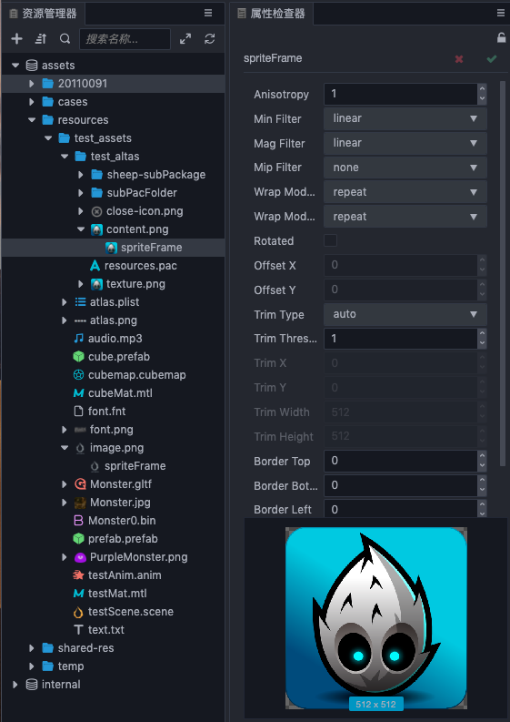

# Sprite Frame Assets

__Sprite Frame__ is a container for __UI rendering__ and basic graphics, which can contain __Texture2D__ assets or __RenderTexture__ assets. In the __Assets Panel__, a __Texture2D__ asset is managed by default.

## Importing Sprite Frame Assets

Use the __default asset import__ method to import image assets into the project and can then be seen in the **Explorer**.



Image assets will use thumbnails of their own pictures as icons in **Explorer**. When the image sub-asset is selected in the **Explorer**, a thumbnail of the image is displayed below the **Property inspector**.

## Using a Sprite Frame

**1. The object contained in the container is using textures**

In the editor, drag the __SpriteFrame__ asset to the __Sprite Frame__ property of the **Sprite** component to switch the image displayed by the __Sprite__. (The entire __SpriteFrame__ asset (`content`) and its sub-asset (` spriteFrame`)).

__Method 1__: (load __ImageAsset__):

```typescript
const self = this;
const url = 'test_assets/test_altas/content';
loader.loadRes(url, ImageAsset,(err: any, imageAsset) => {
  const sprite = this.getComponent(SpriteComponent);
  const spriteFrame = new SpriteFrame();
  (spriteFrame.texture as Texture2D).image = imageAsset;
  sprite.spriteFrame = spriteFrame;
});
```

__Method 2__:（load SpriteFrame)：
```typescript
const self = this;
const url = 'test_assets/test_altas/content/spriteFrame';
loader.loadRes(url, SpriteFrame,(err: any , spriteFrame) => {
  const sprite = this.getComponent(SpriteComponent);
  sprite.spriteFrame = spriteFrame;
});
```

__Assets__ on the server can only be loaded into __ImageAsset__. For specific methods, please refer to the [Asset Loading](./load-assets.md) documentation.

**2. The container contains objects that are used by RenderTexture**

__RenderTexture__ is a rendering texture that renders content from the camera directly to a texture instead of the screen. __SpriteFrame__ can easily display 3D camera content on the UI by managing __RenderTexture__. Use is as follows:

```typescript
const cameraComp = this.getComponent(CameraComponent);
const renderTexture = new RenderTexture();
rendetTex.reset({
   width: 512,
   height: 512,
   colorFormat: RenderTexture.PixelFormat.RGBA8888,
   depthStencilFormat: RenderTexture.DepthStencilFormat.DEPTH_24_STENCIL_8
});

cameraComp.targetTexture = renderTexture;
const spriteFrame = new SpriteFrame();
spriteFrame.texture = renderTexture;
const sprite = this.getComponent(SpriteComponent);
sprite.spriteFrame = spriteFrame;
```

<!-- API 接口文档如下：
* [SpriteFrame 资源类型](https://docs.cocos.com/creator/2.1/api/zh/classes/SpriteFrame.html) -->
