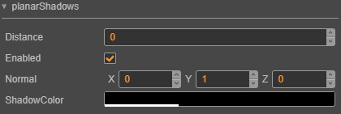

# Shadow

In the 3D world, *light* and *shadows* have always been extremely important components. They can enrich the entire environment, good-quality shadows can achieve the effect of false realization, and make the entire world have a three-dimensional feel to it.

Here is an example of a shadow from __Cocos Creator 3D__:

## Turning on shadows

__Cococs Creator 3D__ currently supports the highly efficient __Planar Shadow__. More __Shadow__ types will be available later. 

It only takes two steps to enable a __Planar Shadow__ in __Cococs Creator 3D__:

  1. Select the Scene node on the level manager, you can see the following panel, check the *Enabled* property of *planarShadows*.
  

  2. Set *ShadowCastingMode* to *ON* in the model that needs to display shadows.
  

  > **__Note:__ __Planar Shadow__ will only be cast on the shadow surface. Adjusting the directional light angle can adjust the shadow projection**.

## PlanarShadows panel

The following describes all the properties of the panel:

| Properties | Explanation |
| --- | --- |
| **enabled** | whether to enable planar shadows |
| **normal** | normals to vertical and shadow planes |
| **distance** | the distance of the shadow plane from the coordinate origin in the direction of the normal |
| **shadowColor** | color value of the resulting shadow |

---

Continue to the [Ambient Light](ambient.md) documentation.