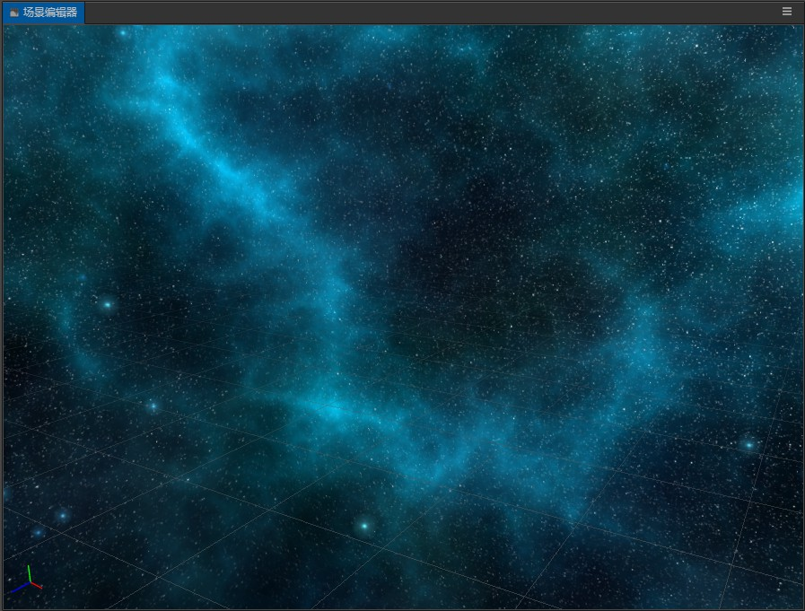

# Skybox

__Skybox__, in video games, is a cube that wraps the entire scene. The __Skybox__ can render the atmosphere of the entire environment and express the environment of the entire scene. The __Skybox__ is also a very important part in the __PBR-based workflow__.

The __Skybox__ in __Cocos Creator 3D__, is shown below:

## Enabling Skybox

Enabling the __Skybox__ effect in __Cocos Creator 3D__, takes just one step:

  - The __Skybox__ panel is on the Scene node's __Properties panel__. Check the *Enabled* property to enable the __Skybox__.
  

 > **Note**: When the *Envmap* property of __Skybox__ is empty, the default pixel map will be used and displayed.

## Modify the environment map of the Skybox

Modifying the environment map of the __Skybox__ in __Cocos Creator 3D__ is done by setting a resource of type __TextureCube__. Importing from a resource into a __TextureCube__ and setting it into a __Skybox__ can be done in the following steps:

  1. Import picture resources. 
  > **Note**: Here is an example of a panorama, we will introduce how to make a `CubeMap` later in this documentation.
  2. Select the imported panorama asset and set it to the __TextureCube__ type in the __Inspector panel__ on the right, as shown in this figure:
  
  3. Drag the __TextureCube__ asset to the __Envmap property__ on the __Skybox's Inspector Panel__.
  

## Skybox panel

The following describes all the properties of the __Skybox__ panel:

| Properties | Explanation |
| --- | --- |
| **enabled** | whether to enable Skybox |
| **envmap** | environment map, type is __TextureCube__ |
| **isRGBE** | whether the pixel format of the environment map is __RGBE__ |
| **useIBL** | whether to use ambient light |

## CubeMap

__CubeMap__ is a kind of environment map resource for a __Skybox__. It is composed of map resources of six faces on a cube. It can be used as a __TextureCube__ resource.

### Making and applying a CubeMap

To make a __CubeMap__ in __Cocos Creator 3D__ and set it to a __Skybox__, follow these steps:

  1. Create a new __CubeMap__ resource, and import the six texture map resources prepared in advance, and set these texture resources to the __Texture__ type.
  2. Drag the imported texture resources into the corresponding input box, and click the green check button when you are finished.
  

  3. Finally, drag the completed __CubeMap__ resource into the __Envmap__ property box of the __Skybox__. This completes the application of a __CubeMap__.

> **Note**: Faces that are not mapped in __CubeMap__. It will be filled with a default texture.