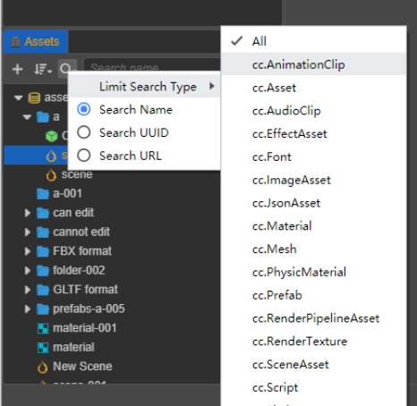

# Asset Manager

The **Assets Panel** is an important tool we use to access and manage project assets. When starting a game, **importing assets** is usually a necessary step. You can use the template project when creating a new project. The project will be opened automatically after the new step is completed. The default layout includes the **Assets Panel**, which contains two asset libraries, referred to as DB, `assets` and `internal`. `internal` belongs to the default built-in assets, which can be copied, but cannot be modified directly. `internal` assets are also shared by all projects.

Panel operation preview:

## Asset Panel Introduction

The **Assets Panel** contains the `head menu area` and the `tree list area` on the panel:

- The functions of the `head menu area` are: **New Resource Button**, **Sorting Method Button**, **Search Filter**, **Search Box**, **All Collapse or Expand Button** , **Refresh list button**
- The `tree list area` mainly reflects the relationship between assets. The root node such as `assets` and `internal` are asset mounts, each mount is similar to the file manager in the operating system. The editor is called a `DB`.
   * `assets` is the project asset mount, which is empty by default in a new project.
   * `internal` is the built-in asset mount. It is a read-only asset and cannot be added, deleted or modified, but it can be directly referenced by your project. You can also copy any internal asset to the project `assets` mount as a template, then modify it as you wish.
   * Panels and nodes have right-click menu events, which are important operating functions. The grayed-out menus are not available.
- Panel shortcuts currently support asset operations:

    - **Copy**: Ctrl or Cmd + C
    - **Paste**: Ctrl or Cmd + V
    - **Clone**: Ctrl or Cmd + D, Ctrl + drag assets
    - **Delete**: Delete
    - **Up and down selection**: up and down arrows
    - **Folder folding**: left arrow
    - **Folder expansion**: right arrow
    - **Multiple selection**: Ctrl or Cmd + click
    - **Multiple selection**: Shift + click
    - **Rename**: Enter/F2
    - **Cancel input**: Esc

## New Assets

__Click__ the **New Asset button** when adding a asset, or right-click menu of a folder, you can enter into creating asset.

When a new asset is added to the folder, an **input box** will appear first. It is required to fill in the name of the new asset. The name cannot be empty.

## Selecting Assets

You can use the following operations to select assets in the list:

- Single click to select assets
- The keyboard up and down arrows can switch the selected asset up and down
- Hold **Ctrl** or **Cmd** + click to select multiple assets
- Hold **Shift** + click to select multiple assets

## Dragging Resources

Assets can also be added by dragging:

- Move the asset, drag the asset from one folder in the tree list to another folder. At this time, the location box of a target folder will follow the change.
- Drag out assets to the **Scene Panel** or **Hierarchy Panel** to generate nodes. Currently, `cc.Prefab`, `cc.Mesh`, `cc.SpriteFrame` assets are supported.
- Drag files from **System File Manager** to the list to import assets.
- Drag in the node and drag the node from the **Hierarchy Panel** to a folder in the **Assets Panel** to save the node as a `cc.Prefab` asset, see the [Prefab](../../asset/prefab.md) documentation.

 

## Deleting Assets

The **Delete** option is located in the right-click menu, or the shortcut key **Delete**, which supports batch deletion after multiple selections. After the asset is deleted, it is kept in the **system recycle bin**, and can be deleted if necessary reduction.

## Selecting All In The Folder

Right-click **Select All** in the menu to select all sub-assets in the folder.

## Searching In Folders

Right-click **Search in Folder** in the menu to narrow the search scope.

## Displaying In The File Manager

Right-click **Show in File Manager** in the menu to locate the system directory where the asset is located.

## Re-importing Assets

Right-click **Reimport Resources** in the menu to update the corresponding assets in `./library` in the project, and these generated data can be recognized by the editor and engine; support multiple selections and batch reimport.

## Sorting Assets

There are 2 sorting methods in the **Sort Method Button** in the header menu: **Sort by Name**, **Sort by Type**. The sorting method is memorized, and the saved sorting method will be kept when the editor is opened next time.

## Searching Assets

The search function is a combined function that can limit the search type and specify the search field.

- **Limited search type** is a major premise. **This point requires special attention**, which may cause the tree list to be empty. The button is highlighted to indicate that the function is enabled.
- Multiple selections are possible, select `All` in the type to return to the normal tree list.
- There are 3 ways to specify the search field: **Search Name**, **Search UUID**, **Search Path**. Among them, **UUID** and **PATH PATH** can output data from the last item of the right-click menu.
- **Search box** changes instantly.
- Select the asset in the search results, clear the search, the window will relocate to the asset, to achieve the purpose of finding the asset through search; in addition, double-click the folder in the search result to quickly locate the folder in the tree.

 

 

## Collapsing assets

- `Head menu area` **All collapse or expand buttons** are global.
- The triangle icon of the tree node, you can press the `alt` key to expand or collapse all sub-assets.

## Renaming Assets

- Select an asset.
- Shortcut key `F2`, shortcut key `Enter`, enter name modification
- Shortcut key `Esc` to cancel rename
- In addition, the initial name of the Typescript asset will be treated as its `className`, and the `className` cannot be repeated.

## Big Picture Preview

In addition, it can be used in conjunction with the Assets Preview panel to click on a folder to display the sub-assets of the big picture arranged by type, which is more intuitive for picture assets.

