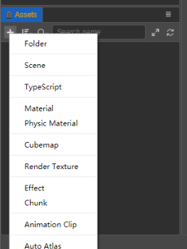
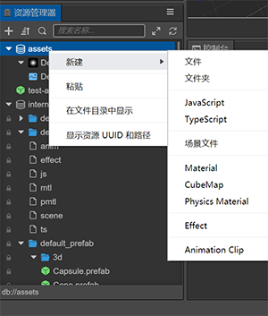
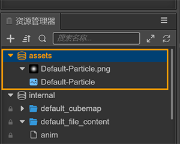
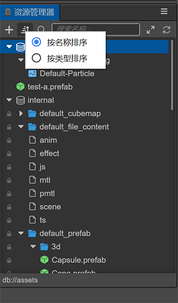
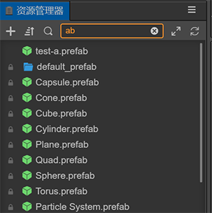

# Explorer

The **Asset Manager** panel is an important tool used to access and manage project assets. When starting to make a game, **importing assets** is usually a necessary step. You can use the __Hello World__ template project as a starting point when creating a new project. After you create and open a new project, various types of assets are visible in the **Explorer** panel.

  

## Explorer Panel introduction

The **Explorer** panel is the main panel. It has a *heads-up menu area*, *a central tree list area*, and a *bottom information display area*.

- The functions of the *heads-up menu area* are: *New asset button*, *Sort by button*, *Search type button*, *Search box*, *Fold or expand all button*, and *Refresh list button*
- The *central tree list area* mainly reflects the hierarchical relationship of assets. The root node is the asset root folder corresponding to the file manager of the operating system. The editor calls an __asset database__ *(DB for short)*, and is located in the project folder. It belongs to the project asset; __Internal DB__ comes with the editor and provides some built-in necessary assets. It is a **read-only** asset. It cannot be *added*, *deleted*, *modified*, but **can** be *directly referenced* or *copied*.
- The *bottom display area* is the URL of the asset after the asset is selected, such as `db://assets`
- The __right-click__ menu of the panel is also an important function. The contents of the __right-click__ menu in different locations are different, and the unavailable menus are grayed out.
- The shortcut of the panel currently supports the operation of assets:

    - **Copy**: Ctrl or Cmd + C
    - **Paste**: Ctrl or Cmd + V
    - **Copy**: Ctrl or Cmd + D, Ctrl + drag asset
    - **Delete**: Delete
    - **Up and down selection**: up and down arrows
    - **Folder folding**: left arrow or Backspace
    - **Expand the folder**: right arrow or Enter
    - **Multi-select**: Ctrl or Cmd + click
    - **Multi-select**: Shift + click

## New assets

__Click__ the **New Asset button** when adding a asset. An **input box** will appear. The name of the asset is required. If the input is empty, the asset will not be created. If there is no selected item in the tree list, it will be newly created on the root node of `Asset DB` by default; if there are multiple selected items, it will be newly created in the first selected item at this time.

In addition, there is a **New** entry in the __right-click__ menu of the folder.

New asset:

  

__Right-click__ on the new asset in the menu:

  

## Selecting an asset

In the __Asset List__, you can use the following operations to select assets:

- __Click__ to __Select Assets__.
- The __up__ and __down__ arrows on the keyboard can be used to select.
- Hold down __Ctrl__ or __Cmd + click__ to select multiple assets.
- Hold down __Shift + click__ to select multiple assets.

## Moving an asset

The assets are moved by dragging the tree nodes:

- **Move the asset**: the asset is dragged from one folder in the tree list to another folder. An orange frame will indicate the range of the folder to which the new location belongs.
- **Drag out assets**: you can drag *.prefab*, *.gltf*, *.mesh*, *.fbx* assets to the **Scene Panel** or the **Level Panel** to generate nodes.
- **Drag the asset**: drag the node from the **Explorer Panel** to a folder in the list. You can save the node as a `.prefab` asset. Please see the[Prefab Asset](../../asset/prefab.md) documentation. From the file manager of the **operating system**, drag the file to the list to realize the asset import.

  

## Deleting an asset

Right-click **Delete** in the menu, or use the keyboards **Delete** key, which supports deleting assets in batches after multiple selections. After the assets are deleted, you can restore them in the **Recycle Bin of the operating system**.

## Re-importing assets

__Right-click__ **Re-import Resource** in the menu to update the data generated to the **Library** and support batch re-importing.

## Sorting assets

The **Sort by button** in the top menu has __2__ sorting methods: *Sort by name*, and *Sort by type*. The sorting method has a memory, and the next time you open the editor, the saved sorting method will be preserved.

  

## Searching for assets

The **Search Type button** in the top menu has __3__ sorting methods: *Search Name*, *Search UUID*, and *Search Type*. Where *Search Type* is the *Import type* of the search asset, not the suffix type of the asset.

The **Search box** changes the instant search. You can select the asset in the search results, after clearing the search content, the selected asset will be relocated within the window to achieve the purpose of locating the asset by searching.

  

## Collapsing assets

The **Fold or expand all button**  is an easy way to retract the view range and find assets easily. The parent node in the tree supports shortcut keys. First select the asset, and then perform keyboard operations:

- __Folder folding__: __left arrow__ or __backspace__
- __Expand the folder__: __right arrow__ or __Eenter/return__ key

## Renaming an asset

Select a asset, use either the __shortcut key F2__ or __right-click__ to get a menu selecting **Rename** to enter to modify the name. The name can not be empty. Use the **shortcut key Esc** will cancel a rename. The name of the script cannot start with a number and cannot be the same as an existing script file.