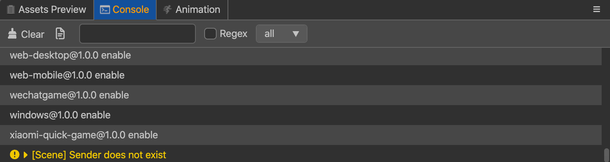

# Console

The **Console** display errors, warnings, or other log information generated by the editor and engine. Information of different levels of importance are displayed.

## Abourt log
The log system is based on the `js` **console** model. When the editor is running, logs will be captured and printed out to the **console** in each process and distinguishes them by color.

  - **Log** (__console.log__): This is gray text, editor messages and developer output are likely to be printed to the **console**.
  - **Warn** (__console.warn__): This is yellow text, when the program is running, abnormal situations that do not affect the program's result are encountered and outputted.
  - **Error** (__console.error__): This is red text, abnormal situations that will affect the result, a problem that must be resolved, or an uncaught error message.

## Panel operation

All the **console**'s functionality is on a toolbar at the top, listed from left to right is:

*  Clear all logs in the current **console**
*  Open log file
*  Enter text to filter the displayed log
*  Whether regular matching is used in text filtering
*  Filter the displayed log types

## Other settings

Other settings for the **console** are available in Preferences. Read about advanced settings in the **[Preferences](../preferences/index.md)** documentation.