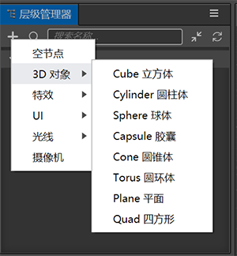
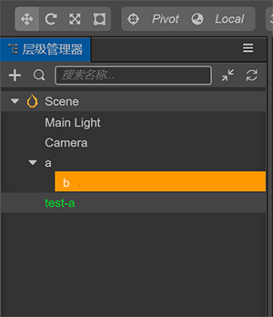
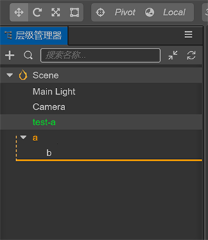
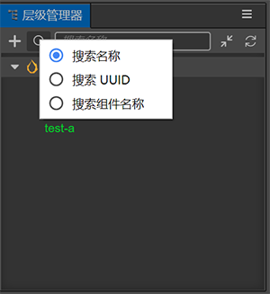

# Hierarchy Manager

**Hierarchy Manager** is the panel used to show the hierarchical relationship of most nodes in the current scene. There are some nodes in the scene that do not need to be displayed, which are generally the necessary factors to support the display of the scene, but they are not operable and can be ignored by the user. If there is a plug-in, you can see the details of the plug-in.

You can *select*, *create*, *move*, *rename* or *delete* nodes in the **Hierarchy Manager**. Any node can create a child node. The coordinate system of the child node is relative to the parent node. Select the node, the node will be highlighted in white on a blue background, and the detailed attributes of the node will be displayed in the **Property Inspector**.

## Hierarchy Manager introduction

**Hierarchy Manager** contains a top menu area and a bottom tree list area on the panel:

  - The functions of the top menu are: **New Node Button**, **Search Type Button**, **Search Box**, **Fold All or Expand Button**, **Refresh List Button**.
  - The tree-like list area at the bottom mainly reflects the hierarchical relationship of nodes. The root node is **scene node**. When editing the prefab file, is the root node **scene node**, but the top node of itself. There is a blank area with a height of 20px at the end of the tree-shaped area. Click here to **uncheck**, that is, the **Level Manager** can have no selected items.
  - The panel supports right-click menus, and the content of right-click menus in different positions and nodes will be different.
  - The panel supports keyboard shortcuts:

    - *Copy*: Ctrl or Cmd + C
    - *Paste*: Ctrl or Cmd + V
    - *Duplicate*: Ctrl or Cmd + D, Ctrl + drag node
    - *Delete*: Delete
    - *Up and down selection*: up and down arrows
    - *Collapse of nodes*: left arrow or Backspace
    - *Expansion of nodes*: right arrow or Enter
    - *Multi-select*: Ctrl or Cmd + click
    - *Multi-select*: Shift + click

## Creating a new Node

Click the **New Node button** when adding a node. An **input box** will appear first. It is required to fill in the name of the node. If the input is empty, the node will not be created. If there are no selected items in the list view, it will be newly created to the current root node by default. If there are multiple selected items, it will be newly created to the first selected node. In addition, there is a **New** entry in the right-click menu of the node.

For the UI node, there is a rule for its display: at least one of its superior nodes needs to contain the `cc.UITransformComponent` component, when creating the UI node, in order to let it display, it will actively check the rule, if the rule is not met, a **Canvas** node will be added as its parent to make it visible after creation.

In addition, a node can be generated by dragging a **prefab** resource from the **Asset Manager** to **Hierarchy Manager**.

## Selecting a node

You can use the following operations to select a node in the node list:

  - Click to select the radio node
  - The up and down arrows on the keyboard can be switched up and down
  - Hold down Ctrl or Cmd + click to select multiple nodes
  - Hold down Shift + click to select multiple nodes

## Moving a Node

The movement of the node is divided into moving above, below and inside the target node.

Two nodes are needed for movement: **the node being moved** and the **target position node**, in which the height of the **target position node** is divided into three sections, upper, middle, and lower, each occupying 4px about. When you move the mouse, the position will be:

  - On the upper side, the style is that the top of the node has an orange horizontal line. At this time, releasing the mouse will move the **moved node** to the top of the **target position node**. Both are flat.
  - In the middle, the style is that the node has an orange bar background. At this time, releasing the mouse will move the **moved node** to the **target position node**, ranked at the end.

  

  - On the lower side, the style is that the node has a dotted connecting line to the tail orange horizontal line. At this time, releasing the mouse will move the **moved node** to the **target position node**, the two are flat.

  

In addition, some attribute values ​​of **Attribute Inspector** require **cc.Node** type data. In this case, you can drag nodes from **Hierarchy Manager** to **Attribute Inspector**.

## Searching Nodes

The **Search Type button** in the header menu has 3 sorting methods: **Search Name**, **Search UUID**, **Search Component Name**. Where **search component name** is the search node component, you can view the component name in **Property Inspector**, such as `cc.ModelComponent`.

The **Search box** supports instant search. Select the node in the search results, after clearing the search content, the selected node will be relocated within the window to achieve the purpose of locating the node by searching.

## Collapsing a node
The **Fold all or expand button** is convenient to retract the view range and find the nodes more easily. The parent node in the tree supports shortcut keys. First select the node, and then perform keyboard operations:

  - *Collapse of nodes*: left arrow or Backspace
  - *Expansion of nodes*: right arrow or Enter

## Renaming a node
Select a node, use the shortcut key F2 or the right-click menu and select **Rename** to modify the name. The name can not be empty. Use the shortcut key **Esc** to cancel the rename operation. **Nodes can have the same name**.