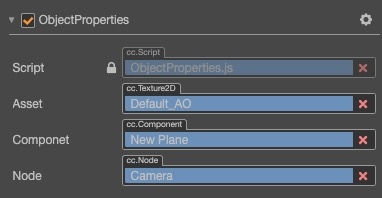

# Property inspector

**Property Inspector** is the work area where developers view and edit the properties of the currently selected nodes and/or components. Select the node in the **Scene Editor** or **Hierarchy Manager**, and the properties of the node and the properties of all components on the node will be displayed in the **Property Inspector** for your query and editing.

## Node name and activation switch

The checkbox in the upper left corner indicates the active state of the node. When the node is inactive, all components related to image rendering on the node will be closed, and the entire node including child nodes will be effectively hidden.

The name of the node is displayed on the right of the node activation switch, which is the same as the node display name in the **Hierarchy Manager**.

## Node properties

In the **Property Inspector** the attributes of the node will be displayed. The attributes of the node are arranged under the Node heading. Click Node to collapse or expand the attributes of the node. There is a node setting button on the right side of the Node title, you can reset the node properties or reset the node properties and the modification of all component properties, or paste the copied components.

In addition to the transformation attributes such as *position*, *rotation*, *scale*, and *size*. The properties of the node also include *anchor*, *color*, *opacity*, and *skew*. Modifying the properties of a node usually allows you to immediately see the node's appearance or position change in the scene editor.

## Component properties
Below the node properties, all components and component properties attached on the node are listed. Just like the node attribute, clicking the component name will switch the collapse/expand state of the component attribute. In the case where many components are attached on the node, you can obtain a larger working area by folding component attributes that are not frequently modified. To the right of the component name are buttons for help documentation and component settings. The help document button can jump to the document introduction page related to the component, and the component setting button can perform functions such as removing, resetting, moving up, moving down, copying and pasting the component.

The attributes of components created by users through scripts are declared by scripts. Different types of properties have different control appearances and editing methods in the Property inspector. We will introduce the definition of properties in detail in the section [Declaring Properties](../../scripting/ccclass.md#property) documentation.

## Editing attributes

**Properties** are variables declared publicly in the component script and can be serialized and stored in the scene and animation data. Through the **Attribute Checker** we can quickly modify the attribute settings to achieve the purpose of adjusting game data and gameplay without programming.

Generally, attributes can be divided into **value types** and **reference types** according to different memory locations of variables.

## Value type attributes

**Value type** includes simple variable types that take up very little memory, such as numbers, strings, and enumerations:

- *Number*: You can directly use the keyboard to enter, or you can press the up and down arrows next to the input box to gradually increase or decrease the attribute value.
- *Vector (Vec2)*: The control of the vector is the combination of two numeric inputs, and the input box will identify the sub-property name corresponding to each numeric value with x and y.
- *String*: Use the keyboard to input the string directly in the text box. The string input control is divided into single line and multi-line. The multi-line text box can be changed by pressing Enter.
- *Boolean*: edit in the form of a check box, the selected state indicates that the attribute value is true, and the non-selected state indicates false.
- *Enum*: Edit in the form of a pull-down menu, click the enumeration menu, and then select an item from the pop-up menu list to complete the modification of the enumeration value.
- *Color*: Click the color attribute preview box, and a color selector window will pop up. In this window, you can directly click the desired color with the mouse, or directly enter the specified color in the RGBA color input box below. Click anywhere outside the color selector window to close the window and use the last selected color as the attribute color.

## Reference type attributes

**Reference types** include more complex objects, such as *nodes*, *components*, or *assets*. Different from the various editing methods of the value type, the reference type usually has only one editing method: **Draging the node or asset to the property bar**.

The attributes of the reference type will show `None` after initialization, because the initial value of the attributes of the reference type cannot be set by script. You can drag and drop the corresponding type of node or asset according to the type of attribute to complete the reference assignment.

The property bar that needs to be dragged to assign a value will be displayed as a label. `cc.Node` may be displayed on the label, indicating that any node can be dragged up, or the label shows the component name such as `cc.AnimationComponent`, etc. Only the nodes that contain the corresponding components will do.

The attribute bar that needs to be dragged and assigned to the asset will be displayed as a label. The label shows the type of asset, such as prefab and texture. Just drag and drop the corresponding type of asset from the **Asset Manager** to complete the assignment.

## Merge operation

**Attribute checker** allows multiple selection of nodes, and modify the attributes on multiple nodes at the same time. After selecting multiple nodes, the inconsistent attributes will be displayed as the invalid behavior of **UI Components**.

