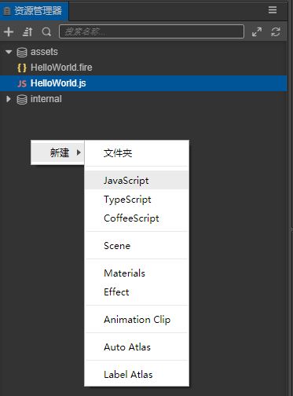
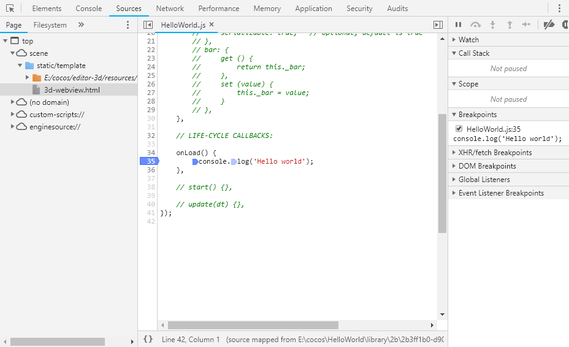

# Hello World project

This is the very first __Cocos Creator 3D__ project, and it aims to demonstrate the following:
- Creating a project
- Understanding the project directory
- Creating an object
- Modifying `Camera` properties
- Creating, modifying, and binding scripts
- Running projects

## Creating a New Project

Select an empty template, set the project path, and click the __New Project__ button below.


## The Editor interface

This is the default layout of the __Editor__ interface: 


The layout is customizable, if you don't find the default layout suitable.

## Project Directory
Usually, the most commonly used directory is `assets`. There are others:

- assets (resources directory)
- build (build directory)
- library (imported resources directory)
- local (log file directory)
- profiles (editor configuration)
- temp (temporary file directory)
- package.json (project configuration)

## Creating a New Scene

In the bottom left __Explorer__ panel, __click the right mouse button__ and select __New__->__Scene__.


## Creating an Object

Upper left __Hierarchy Manager__ panel, click the __right mouse button__, select __Create__ -> __3D object__ -> __Cube cube__. The created cube will appear in the scene editor.


## Modifying the Camera

### Selecting the `Camera` object
In the __Hierarchy Manager__ panel, select `Camera`, and the scene editor will select it and display a __Gizmo__.


### Modifying the `Camera` position
In the scene editor, drag the __Gizmo__ so that the `Camera` can see the created cube.


### Modifying the `Camera` background color
In the __Property Inspector__ panel, click the `Color` property and select black as the background color. 


## Adding a script

### Creating a new script
In the __Explorer__ panel, __click the right mouse button__, select __New__ -> __JavaScript__. 



### Life cycle functions
Life cycle functions (called in the following order):
   - `onLoad`
     Called when the script is initialized
   - `onEnable`
     Called when the enabled property of the component changes from `false` to `true`
   - `start`
     Called when the component is first activated
   - `update` 
     Update object call before rendering each frame
   - `lateUpdate`
     Called after the update of all components has been executed
   - `onDisable`
     Called when the `enabled` property of the component changes from `true` to `false`
   - `onDestroy`
     Called when the component or node is destroyed

### Adding code
Add `onLoad()` function to output `Hello world`:

```ts
import {_decorator, Component} from "cc";
const {ccclass, property} = _decorator;

@ccclass("normal")
export class normal extends Component {
    /* class member could be defined like this */
    // dummy ='';

    /* use `property` decorator if your want the member to be serializable */
    // @property
    // serializableDummy = 0;

    start () {
        // Your initialization goes here.
        console.info('Hello world');
    }

    // update (deltaTime) {
    // // Your update function goes here.
    //}
}
```

### Bind scripts to objects
Select the created cube and click __Add component__ -> __custom script__->__HelloWorld__


## Running a project
In the __Editor__, from the __menu bar__ click __Project__ -> __Run preview__, or Click the __Run__ button in the middle. 


## Debuging a project
In the __Editor__, from the __menu bar__ click __developer__ -> __scene debugging tool__</font>

It is also may be necessary to Log information. The __Console__ panel displays all log output.


__Breakpointsa__ can also be placed for stooping execution of the debugger to examine values. Select the __Source__ option on the __tab bar__ and press __CTRL+P__, Search for `HelloWorld.js`, set a breakpoint in the `onLoad()` function, and then run the preview to debug. 

