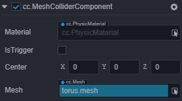

# Physics Component

__Cocos Creator 3D__ currently provides users with a variety of __collider components__, common __rigid body components__, as well as __tool-type constant force components__.

## Collider Component

The __collider component__ is used to represent the shape of the __collision body__ of a __rigid body__. Different geometric shapes have different properties.

### BoxColliderComponent

  Properties | Description
  ---|---
  *material* | The physics material referenced by the collider (the default physics material was referenced when it is empty)
  *isTrigger* | Whether it is a trigger, the trigger will not generate physical feedback
  *center* | The origin of the shape in the local coordinate system
  *size*  | The size of the box, ie length, width, height

### SphereColliderComponent

Properties | Description (Other reference box colliders)
---|---
*radius* | Radius of the sphere

### CylinderColliderComponent

Properties | Description (Other reference box colliders)
---|---
*direction* | The reference axis of the cylinder's extended direction
*height* | The total height of the cylinder
*radius* | The radius of the circular surfaces at both ends of the cylinder

> **Note**: `builtin` does not currently support cylindrical components.

### CapsuleColliderComponent

Properties | Description（Other reference cylinders and box colliders）
---|---
*cylinderHeight* | The height of the cylinder in the capsule
*radius* | The radius of the sphere in the capsule

> **Note**: `cannon.js` does not support capsule components. It is recommended to use two spheres and cylinders and piece them together.

### MeshColliderComponent

Properties | Description (Other reference box colliders)
---|---
*mesh* | The mesh resource referenced by the mesh collider, used to initialize the mesh collision volume

> **Note**: `builtin` does not currently support the mesh collider component.

> **Note**: `cannon.js` has poor support for the mesh collider component, and only allows detection with the sphere collider**.

> **Note**: `ammo.js` currently only supports static mesh colliders (`mass` is `0` or without a `RigidBody` component).

## RigidBodyComponent

In order to more easily simulate physical behavior, __Cocos Creator 3D__ provides users with __rigid body components__.

Properties | Description (The property values ​​in the above picture are all default values)
---|---
*mass* | The mass of the object (when the mass is 0, it represents a static rigid body, which is the same as the effect without the rigid body component)
*linearDamping* | Linear damping, used to reduce the linear velocity of an object
*angularDamping* | Angular damping, used to reduce the rotation rate of objects
*isKinematic* | Whether the rigid body is controlled by the user, regardless of the physics engine
*useGravity* | Whether the rigid body is affected by gravity
*fixedRotation* | Whether it is necessary to fix the object's rotation during collision
*linerFactor* | Linear factor, which can affect the change of linear velocity in each axis
*angularFactor* | Rotation factor, which can affect the change of the rotation speed of each axis

> **Note**: `builtin` does not currently support `RigidBodyComponent`.

## ConstantForce

This is a tool component that depends on a `RigidBodyComponent` and will apply a given force and torque to a rigid body every frame.

Properties | Description
---|---
*force* | The force applied to the rigid body in the world coordinate system
*localForce* | The force applied to the rigid body in the local coordinate system
*torque* | Torque applied to the rigid body in the world coordinate system
*localTorque* | Torque applied to the rigid body in the local coordinate system

> **Note**: `builtin` does not currently support Hengli components*.

---

Continue to the [using physics](physics-use.md) documentation.
