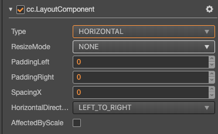

# Layout Component Reference

Layout is a container component. The container can unlock the auto-layout function to automatically arrange all the sub-objects according to the specifications, so that the developer can use it to make list, page turning and other functions conveniently.

- Horizontal Layout

  

- Vertical Layout

  

- Grid Layout

  

Click the **Add Component** button at the bottom of the **Inspector** panel and select **UI/Layout** to add the Layout component to the node.

## Layout Properties

| Properties           | Function Explanation      |
| --------------       | -----------   |
| Type                 | Layout type, including NONE, HORIZONTAL, VERTICAL and GRID. See [Auto Layout](../engine/auto-layout.md) for details. |
| ResizeMode           | Resize mode, including NONE，CHILDREN and CONTAINER. |
| PaddingLeft          | The left padding between the sub-object and the container frame in the layout. |
| PaddingRight         | The right padding between the sub-object and the container frame in the layout. |
| PaddingTop           | The top padding between the sub-object and the container frame in the layout. |
| PaddingBottom        | The bottom padding between the sub-object and the container frame in the layout. |
| SpacingX             | The spacing between sub-objects in the horizontal layout. NONE mode doesn't have this property. |
| SpacingY             | The spacing between sub-objects in the vertical layout. NONE mode doesn't have this property. |
| HorizontalDirection | When it is designated as horizontal layout, which side does the first child node start in the layout? The container left or the right? When the Layout type is set to Grid, this property with Start Axis property determines the starting horizontal alignment of Grid layout elements. |
| VerticalDirection   | When it is designated as vertical layout, which side does the first child node start in the layout? The container upside or the downside? When the Layout type is set to Grid, this property with Start Axis property determines the starting vertical alignment of Grid layout elements. |
| CellSize            | This property is only available in Grid layout, CHILDREN resize mode. The size of each child elements. |
| StartAxis           | This property is only available in Grid layout, the arrangement direction of child elements. |
| AffectedByScale    | Whether the scaling of the child node affects the layout.  |

## Detailed Explanation

The default layout type is NONE after adding the Layout component. It indicates that the container won't change size and position of the sub-object. When the user places sub-object manually, the container will take the minimum rectangular region that can contain all the sub-objects as its own size.

You can switch the layout container type by altering `Type` property in **Inspector** panel, all the layout types support `Resize Mode`.

- When **Resize Mode** is **NONE**, the size of the container and sub-object is independent of each other.

- When **Resize Mode** is **CHILDREN**, the size of the sub-object will change with the size of the container.

- When **Resize Mode** is **CONTAINER**, the size of the container will change with the size of the sub-object.

When using **Grid** layout, the **Start Axis** is very important.

- When choosing **HORIZONTAL**, it will fill an entire row before a new row is started.

- When choosing **VERTICAL**, it will fill an entire column before a new column is started.

**Node**: After setting the Layout, the results need to be updated until the next frame, unless you manually call `updateLayout` API.
