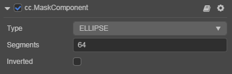

# Mask Component Reference

__Mask__ is used to specify the range which clip the render results of the children. A node with a __Mask__ component will use a bounding box (which is specified by the `contentSize` of the __UITransform__ component in the __Inspector__) to create a rectangular rendered mask. All child nodes of this node will only appear inside the mask's boundary.

Select a node in the __Hierarchy__ panel, then click the __Add Component__ button at the bottom of the __Inspector__ panel and select __Mask__ from __UI -> Render__. Then you can add the Mask component to the node.

> __Note__: The Mask component cannot be added to a node with other renderer components such as __Sprite__, __Label__, etc.

## Mask Properties

| Properties | Function Explanation |
| -------------- | ----------- |
| *Type*           | Mask type, including `RECT`, `ELLIPSE`, `GRAPHICS_STENCIL`. |
| *Segments*       | The segements for ellipse mask, which takes effect only when the Mask type is set to `ELLIPSE`.   |
| *Inverted*       | The Reverse mask. |

> __Note__:
> 1. After adding the __Mask__ component to a node, all nodes in the sub tree of this node will be affected by __Mask__ during rendering.
> 2. The `GRAPHICS_STENCIL` simply provides the __graphics__ component, which developers can use to draw custom graphics. But the node click events are still calculated based on the size of the node.
