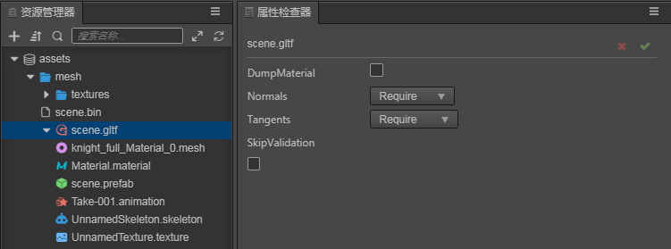

# 模型资源

目前，我们支持 FBX 和 GLTF 两种格式的模型文件。

## 模型导入

从外部导入编辑器中后，在 `资源管理器` 中可得到对应的模型资源文件，其目录结构如下：（以 glTF 文件为例，fbx 文件相同）

- 无动画的模型文件结构如下：

- 包含动画的模型文件结构如下：

- 其中：
   - .material 文件为材质文件
   - .mesh 文件为模型文件
   - .texture 文件为模型贴图文件
   - .animation 文件为模型动画文件
   - .skeleton 文件为模型骨骼文件
   - .prefab 文件为导入时自动生成的预制体文件

## 模型使用

将模型文件导入后，将模型文件的节点展开，选中模型文件节点下的 `.prefab` 文件，从 `资源管理器` 拖拽到 `层级管理器` 中想要放置的节点下即可完成节点创建，此时模型就成功在场景中创建了

## 模型资源属性面板说明

当在 `资源管理器` 中 选中模型资源文件时（ .fbx 或 .gltf ）,在 `属性检查器` 中可以设置模型资源的相关属性：

- DumpMaterial ：当对模型文件自带的材质不满意想要修改时，需开启此选项，将文件结构目录下的材质文件 Dump 出模型资源中，此时就可以进行 材质的调整修改了
- Normals 法线信息：有 Optional，Exclude，Require，Recalculate 四种选项
- Tangents 切空间信息：有 Optional，Exclude，Require，Recalculate 四种选项
- SkipValidation ：是否跳过标准检测

## 关于 glTF

目前我们的引擎已支持 glTF 2.0 规范，但暂时不支持以下功能：
- Sparse accessor
- morph target
