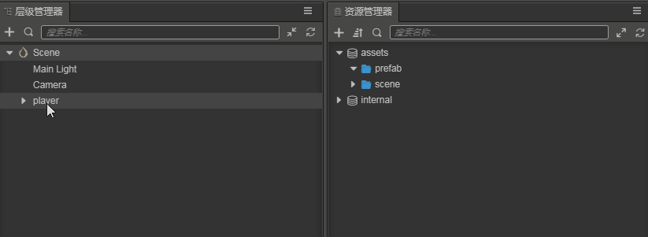
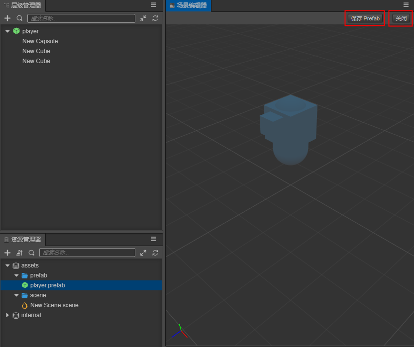
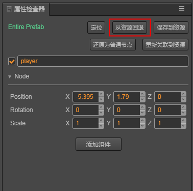
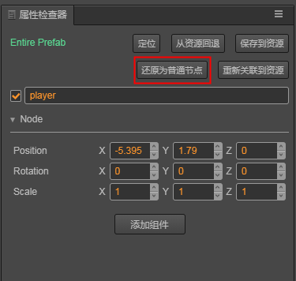

# 预制资源（Prefab）

对于项目中会重复生成的节点，使用预制体是很有必要的。

## 创建预制

在场景中将节点编辑好之后，直接将节点从 `层级管理器` 拖到  `资源管理器` 中即可完成预制体的创建。 
完成创建后，原节点自动变为该预制体实例。

## 修改预制体

修改预制体有两种方式：
方式一：直接双击 `资源管理器中` 的预制体文件，此时可以在编辑器中编辑预制体资源，编辑完成之后，点击场景编辑器中的 `保存 Prefab` 即可保存编辑后的预制体，之后点击 `关闭` 可返回之前正在编辑的场景。

方式二：在场景中修改任意预制体实例之后，在 `属性检查器` 中点击 `保存到资源` ，可将变更保存到资源。

此处的修改预制体资源在保存之后，再通过该预制体创建的新实例将会与更改后的资源相同，但在修改前已创建的实例并不会发生变化，此时如果想要将实例更新为更改后的预制体资源，操作与 [还原预制](#还原预制) 相同。

请注意，目前 Cocos Creator 3D 目前尚未添加 prefab 实例与资源自动同步的功能，该功能会在之后的版本中推出，请留意更新公告。

## 还原预制

在场景中修改了预制实例后，在 `属性检查器` 中直接点击 `从资源回退`，即可将预制对象还原为资源中的状态，该操作也可用于当预制资源已改变但实例未更新的情况

## 还原为普通节点

在编辑时随时可将预制体实例还原为普通节点，只需选中预制体实例在 `属性检查器` 中点击 `还原为普通节点` ，即可变为普通节点。

## 预制的其他选项

预制体实例的 `属性检查器` 的其他功能如下：
- 定位：可快速点位到该实例的资源原型
- 重新关联到资源：当实例节点变红时（资源丢失），选中想要重新关联的预制资源，再点击 `重新关联到资源` 可将资源关联
