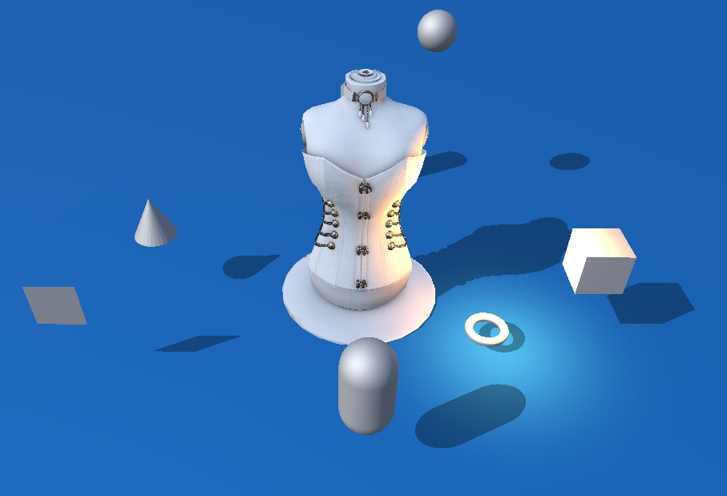
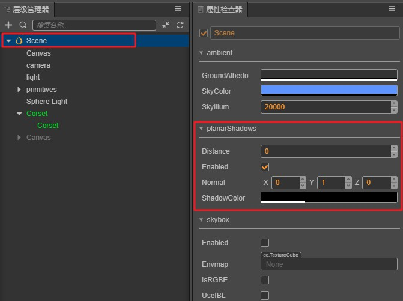

# 阴影

在 3D 世界中，光与影一直都是极其重要的组成部分，它们能够丰富整个环境，质量好的阴影可以达到以假乱真的效果，并且使得整个世界具有立体感。

以下为 Cocos Creator 3D 的阴影示例：

## 开启阴影

Cocos Creator 3D 目前支持高性价比的 Planar Shadow ，后面会提供更多 Shadow 类型，请留意更新公告。

在 Cocos Creator 3D 中开启 Planar Shadow 只需要两步：

1. 在层级管理器上选择 Scene 节点，可以看到以下面板，将 planarShadows 的 Enabled 属性勾选上。

2. 将需要显示阴影的模型组件中的 ShadowCastingMode 设置为 ON 。

**注：Planar Shadow 只会投射在阴影面上，调节方向光角度可以调节阴影的投射**。

## PlanarShadows 面板

以下介绍了面板的所有属性：

属性 | 解释
---|---
**enabled** | 是否开启 planar shadows
**normal** | 垂直与阴影平面的法线
**distance** | 阴影平面在 normal 法线的方向上与坐标原点的距离
**shadowColor** | 产生的阴影的颜色值

---

继续前往 [场景](index.md) 说明文档。
