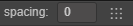

动画编辑器一共可以划分为 6 个主要部分。

a. [工具栏](###a.工具栏)
b. [时间轴与事件](###b.时间轴与事件)
c. [节点列表](###c.节点列表) 
d. [节点内关键帧预览](###d.节点内关键帧预览) 
e. [属性列表](###e.属性列表)
f. [属性轨道关键帧预览](###f.属性轨道关键帧预览)  

### a.工具栏
这里负责显示一些常用功能按钮
1. 移动到第一帧(Ctrl / Cmd + Left)： 点击移动到第一帧。
2. 移动到前一帧(Left)： 点击移动到前一帧。
3. 播放/暂停(Ctrl / Cmd + P)：点击播放/暂停当前动画。
4. 移动到下一帧(Right)： 点击移动到下一帧。
5. 移动到最后一帧(Ctrl / Cmd + Right): 移动到有效范围的最后一帧。
6. 停止动画(Ctrl / Cmd + S)：点击停止当前动画，停止后将会移动到第一帧。
7. 控制时间轴显示刻度和当前时间：
   - 其中的 time 是一个可以点击的按钮，点击可以切换时间轴的刻度显示，默认是 `00-00`的方式，可以切换为 `frame`的方式。具体关于时间轴刻度可以参见[时间轴的刻度单位表示方式](###时间轴与事件区域)。
   - 后面的输入框内是显示当前时间控制线的具体时间，也可以手动输入来使当前时间控制线调整到对应时间，支持直接输入 `frame` 或者是 `00-00` 的时间刻度。
8. 调整默认关键帧间隔数与排列关键帧按钮：填入的关键帧间隔数将作为有多个关键帧同时生成时取做间隔数（例如：制作帧动画一次性拖入多张图片，此时添加的多个关键帧之间的间隔会取该值），右边的类似于棋盘的按钮则是用于排列选中的关键帧，选中的关键帧将以第一个帧为基准，以输入框内的数值作为间隔依次排列。
9. 添加事件关键帧： 点击将会在当前时间控制线的位置添加事件关键帧。
10. 退出动画编辑模式：：点击退出动画编辑模式

### b.时间轴与事件
这里主要是显示时间轴，添加的自定义事件帧也会在这里显示。同时右键点击可以将事件控制先移动到对应位置，右键菜单可以进行 `添加/移除`、`复制/粘贴` 事件关键帧等，同时动画的有效长度也会有对应的显示效果。

#### 时间轴的刻度表现方式
默认时间轴上刻度的表示法是 `01-05`。该数值由两部分组成，前面的数字表示当前秒数，后面的数字表示在当前这一秒里的第几帧。

`01-05` 表示该刻度在时间轴上位于从动画开始经过了 1 秒又 5 帧 的时间。

因为帧率（sample）可以随时调整，因此同一个刻度表示的时间点也会随着帧率变化而有所不同。

- 当帧率为 30 时，`01-05` 表示动画开始后 1 + 5/30 = 1.1667 秒。
- 当帧率为 10 时，`01-05` 表示动画开始后 1 + 5/10 = 1.5 秒。

虽然当前刻度表示的时间点会随着帧率变化，但一旦在一个位置添加了关键帧，该关键帧所在的总帧数是不会改变的， 假如我们在帧率 30 时向 `01-05` 刻度上添加了关键帧，该关键帧位于动画开始后总第 35 帧。之后把帧率修改为 10，该关键帧仍然处在动画开始后第 35 帧，而此时关键帧所在位置的刻度读数为 `03-05`。换算成时间以后正好是之前的 3 倍。

点击按钮 可以将刻度更改为 `frame` 的方式，并来回切换。

#### 事件关键帧
在时间轴位置右键或者点击时间轴按钮可以添加事件关键帧，点击事件关键帧邮件菜单可以对齐进行移除、复制等操作，同时选中后也支持一系列的复制粘贴、删除快捷键。

### c.节点列表
clip 动画数据中索引节点的方式是以挂载 Animation 组件的节点为根节点的相对路径，
因而在同个父节点下的同名节点，只能够产生一份动画数据，并且只能应用到第一个同名节点上。

这里的节点与层级管理器的节点是一一映射的，利用这个关系，当节点列表的节点数量过多难于查阅时，可以利用层级管理器的搜索功能来定位节点。在层级管理器点击节点，在动画编辑器内也会相应的跳转到对应节点位置来达到合理的显示效果。

#### 选中节点图示

由于动画编辑器的节点列表融合了 clip 里面的数据后有可能会出现比原节点更多的节点信息，但这部分多余的节点就是丢失的节点，是无法编辑与使用的，界面上会显示为黄色同时关键帧轨道处也是置灰的状态。这时候可以将丢失的节点通过右键菜单的迁移数据来将数据转移到其他节点上。
具体的操作指南可以参见后续创建动画剪辑的章节。

### d.节点内关键帧预览
这里主要是显示各个节点上的所有帧的预览。在此处关键帧位置右键菜单可以删除关键帧，亦可以移动关键帧的位置。同时单击此处不同节点的关键帧将会选中对应的节点，双击关键帧可以将时间控制线移动到该位置，在没有选中属性的情况下， Ctrl / Cmd + Shift + Left / Right 可以将时间控制线向上/下一个关键帧位置处移动。

### e.属性列表
主要显示当前选中节点上参与动画的属性列表，每条属性显示项上有关键帧的 icon 图示，对应当前属性轨道对应当前时间控制线位置的关键帧状态，点击可以添加/移除对应关键帧。右键菜单可以移除当前轨道或清空数据等。在上方的加号按钮点击可以为当前选中节点添加属性轨道。

与节点一样的是，属性轨道也有存在丢失的可能，当前节点上不存在动画 clip 里记录的属性，该属性便是当前节点下丢失的属性。丢失的属性一样显示为黄色，这种情况下可以退出编辑模式后给对应节点添加相关属性或是直接移除该丢失的属性轨道。

### f.属性轨道关键帧预览
主要显示各个属性轨道上具体的关键帧设置情况，也是关键帧编辑的主要区域。可以直接在轨道上右键来添加关键帧，亦可以拖动时间控制线到对应位置后按下 enter 键添加。同时在该区域也支持框选、点选关键帧来进行移动、复制、粘贴等操作。

## 基本操作指南
### 切换不同的动画剪辑进行编辑
- 点击动画编辑器左下角的 clip 选项，选择需要编辑的 clip 既可
- 在动画编辑模式下，点击其他带有动画剪辑的节点，既可将当前动画根节点切换为新选中的节点，从而编辑新的动画剪辑

### 更改时间轴缩放比例

在操作中如果觉得动画编辑器显示的范围太小，需要按比例缩小，让更多的关键帧显示到编辑器内怎么办？

 - 在图中b、d、f区域内滚动鼠标滚轮，可以放大，或者缩小时间轴的显示比例。

### 移动显示区域

如果想看动画编辑器右侧超出编辑器被隐藏的关键帧或是左侧被隐藏的关键帧，这时候就需要移动显示区域：

 - 在图中b、d、f区域内按下鼠标中键/右键拖拽。

### 更改当前选中的时间

 - 在时间轴（图 b 区域）区域内点击任意位置或者拖拽，都可以更改当前的时间节点。
 - 拖拽时间控制线
 - 在工具栏点击控制时间控制线的按钮
 - 双击关键帧，可以将当前时间跳转到对应位置
 - 使用快捷键控制当前时间位置

### 播放/暂停动画

 - 在图 a 区域内点击播放按钮，按钮会自动变更为暂停，再次点击则是播放
 - 播放状态下，保存场景等操作会终止播放
 - 快捷键 Ctrl / Cmd + P 控制

更多关于关键帧的操作，请查看`编辑动画剪辑`章节

## 快捷键

 - Left(←)：向前移动一帧，如果已经在第 0 帧，则忽略当前操作。
 - Right(→)：向后移动一帧
 - Ctrl / Cmd + Left(←): 移动到第一帧
 - Ctrl / Cmd + Right(→): 移动到 clip 内最后一帧
 - Delete / Ctrl + Backspace：删除当前所选中的关键帧
 - Alt + P: 播放/暂停
 - Alt + S: 停止
 - Enter：在时间控制线位置添加当前选中节点上选中属性轨道的关键帧，没有选中情况则忽略
 - Ctrl / Cmd + Shift + Left(←): 移动到时间控制线左边最近的一个关键帧（选中属性轨道上或选中节点上）
 - Ctrl / Cmd + Shift + Right(→): 移动到时间控制线右边最近的一个关键帧（选中属性轨道上或选中节点上）
 - Ctrl / Cmd + C: 复制选中的关键帧
 - Ctrl / Cmd + V: 粘贴上一次复制的关键帧
 - Ctrl：按住不放可多选关键帧
 - Alt: 选中关键帧后，按下 Alt 并拖动选中的关键帧可以复制对应的关键帧到新的移动位置 