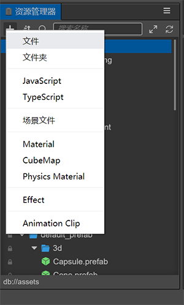

# 资源管理器

 **资源管理器** 面板是我们用来访问和管理项目资源的重要工具。
 在开始制作游戏时，**导入资源** 通常是必须的步骤。您可以在新建项目时使用模板项目，新建步骤完成后会自动打开项目，默认布局中包含了 **资源管理器** 面板，里面有两个资源库，简称 DB，`assets` 和 `internal`, `internal` 属于默认的内置资源，内置资源可以复制出来，但不能直接修改。

 面板操作预览

 

## 面板介绍

**资源管理器** 面板上主要有 `头部菜单区 `， `树形列表区`：

- `头部菜单区` 的功能有：**新建资源按钮** ，**排序方式按钮** ，**搜索过滤** ，**搜索框**，**全部折叠或展开按钮** ，**刷新列表按钮**
- `树形列表区` 主要体现资源之间的关系，根节点如 `assets` 类似操作系统里的文件管理器，编辑器中称之为一个 DB
  * `assets` 是项目资源，新项目下默认为空；
  * `internal` 是内置资源，属于只读资源，不可进行增删改操作，但可以作为资源模板，复制到 Assets DB 上进行粘贴，即新建了一个项目资源。
  * 面板和节点都有右击菜单事件，是重要的操作功能，灰色为不可用菜单。
- 面板的快捷方式目前支持资源的操作：

    - 复制：Ctrl or Cmd + C
    - 粘贴：Ctrl or Cmd + V
    - 克隆：Ctrl or Cmd + D，Ctrl + 拖动资源
    - 删除：Delete
    - 上下选择：上下箭头
    - 文件夹的折叠：左箭头
    - 文件夹的展开：右箭头 
    - 多选：Ctrl or Cmd + 点击
    - 多选：Shift + 点击
    - 重命名： Enter/F2
    - 取消输入：Esc

## 新建资源

** + ** 号是 `assets` 新建资源按钮，或者文件夹的右击菜单，都可以进入创建资源。

文件夹内新增资源，会先出现一个 **输入框** 要求填入新资源的名称，名称不能为空。

## 选中资源

在列表中可以使用以下操作选中资源：

- 单击可单选资源
- 键盘上下箭头可以上下切换选中资源
- 按住 Ctrl or Cmd + 点击，可以多选资源
- 按住 Shift + 点击，可以多选资源

## 移动资源

通过拖动来实现资源的移动：

- 移动资源，资源从树形列表中的一个文件夹里拖出到另一个文件夹，此时会有一个目标文件夹的位置框跟随变动。
- 拖出资源到 **场景面板** 或 **层级面板** 去生成节点，目前支持 `cc.Prefab`, `cc.Mesh`, `cc.SpriteFrame` 资源。
- 从 **系统的文件管理器** 拖动文件到列表中，实现导入资源。
- 拖入节点，从 **层级面板** 拖动节点到 **资源面板** 里某个文件夹，可实现保存该节点为一个 `cc.Prefab` 资源, 详见 [预制资源（Prefab）](../../asset/prefab.md)；

 

## 删除资源

可操作右击菜单中的 **删除** 按钮，或快捷键 **Delete**，支持多选后批量删除，资源删除后保留在 **系统的回收站** 里，必要时可将其还原。

## 在文件夹内全选

右击菜单中的 **全选** 可实现在该文件夹内全选子资源。

## 在文件夹内搜索

右击菜单中的 **文件夹内搜索** 可缩小搜索范围。

## 在文件管理器中显示

右击菜单中的 **在文件管理器中显示** 可定位资源所在的系统目录。

## 重新导入资源

右击菜单中的 **重新导入资源** 可以更新项目里 `./library` 内对应的资源，这些生成过的数据才可被编辑器和引擎识别；支持多选后批量重新导入。

## 排序资源

头部菜单中的 **排序方式按钮** 有 2 种排序方式：**按名称排序**，**按类型排序**，
排序方式有记忆，下次打开编辑器会保持已存的排序方式。

## 搜索资源

搜索功能是一种组合的功能，可限定搜索类型，且指定搜索字段。
- **限定搜索类型** 是一个大前提，**这点需要特别注意**，可能会导致树形列表为空，该按钮高亮即表示有启用该功能。
- 可多选，选择类型里面的 `All` 才能返回正常的树形列表。
- 指定搜索字段有 3 种方式：**搜索名称**，**搜索 UUID**，**搜索路径**。其中 **UUID** 和 **路径 PATH** 可从右击菜单最后一项中输出数据。
- **搜索框** 是即时变动的；
- 在搜索结果中选中资源，清空搜索，视窗会重新定位到该资源，达到通过搜索来找到资源的目的；此外搜索结果中双击文件夹，可快速定位到树形中该文件夹。

 

 

## 折叠资源

- `头部菜单区` **全部折叠或展开按钮** 作用于全局；
- 树形节点的三角图标，可按 `alt` 键实现子资源全部展开或折叠

## 重命名资源

- 选中某个资源
- 快捷键 `F2`，快捷键 `Enter`，进入名称修改
- 快捷键 `Esc` 取消重命名
- 此外 ts 脚本资源的初始名称会处理为它的 `className`, 而 `className` 是不能重复的。

## 大图预览

此外可与 Assets Preview 面板配合， 点击一个文件夹，可按类型排列显示大图子资源，对于图片资源会较为直观。

 
