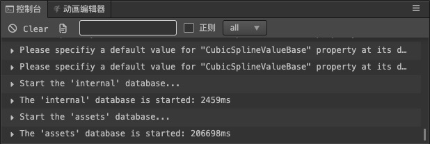

# 控制台

**控制台** 会显示报错、警告或其他编辑器和引擎生成的日志信息。不同重要级别的信息会以不同颜色显示。

## 关于日志

日志系统基于 js 的 console 模块。编辑器运行的时候，会捕获每一个进程里 console 打印出来的必要日志，并以颜色进行区分。

会被捕获的日志类型以及显示颜色：

  - 日志（console.log）: 灰色文字，编辑器以及插件内开发者觉得有必要打印到控制台的内容。
  - 警告（console.warn）: 黄色文字，程序运行遇到的不影响结果的异常情况。
  - 错误（console.error）: 红色文字，运行中遇到的会影响结果的一场，必须解决的问题，或者是未被捕获的错误信息。

## 面板操作

控制台所有的功能都在顶部的一条工具栏上，从左到右的功能依次是：

1. 清空当前控制台内的所有日志
2. 打开日志记录文件
3. 输入文本以过滤显示的日志
4. 输入文本是否启用正则匹配
5. 过滤显示的日志类型

## 其他设置

控制台的其他设置在偏好设置内，请参考 [偏好设置](../preferences/index.md) 里的扩展设置。