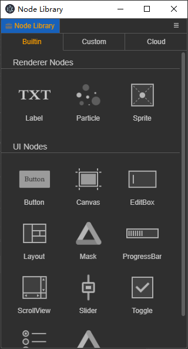

# 节点预制库

**节点预制库** 提供便捷的管理需要复用的节点，提供 **内置** **自定义** 列表

## 使用方式

- 拖动列表上的节点到 **层级面板** 或 **场景面板** 生成新节点。
- 拖动 **资源面板** 上的 prefab 预制件资源到 **自定义** 列表，便收藏了一个新的自定义节点。
- **自定义** 列表的节点支持右击菜单：删除，定位到资源。


## 扩展面板列表

走插件的 "contributions" 扩展方式

package.json

``` json
    "contributions": {
        "node-library": [
            {
                "name": "clould",
                "methods": "./node-library.js",
                "groups": "getCloudGroups"
            },
            {
                "name": "favorite",
                "methods": "./node-library.js",
                "groups": "getFavoriteGroups"
            }
        ],

```
`./node-library.js` 为

``` typescript
module.exports = {
    getCloudGroups() {
        const data: NodeLibraryGroup[] = [];
        return data;
    },
    getFavoriteGroups() {
        const data: NodeLibraryGroup[] = [];
        return data;
    },
};

```

类型说明：

``` typescript

interface NodeLibraryGroup {
    name: string; // 组名
    items: NodeLibraryItem[];
}

interface NodeLibraryItem {
    name: string;
    value: string;
    type: string;
    icon?: string;
    canvasRequired?: boolean; // 类似 UI 节点，是否需要挂在有 UITransform 组件节点里
    unlinkPrefab?: boolean; // 是否要成为一个普通节点，默认为 true
}

```

 