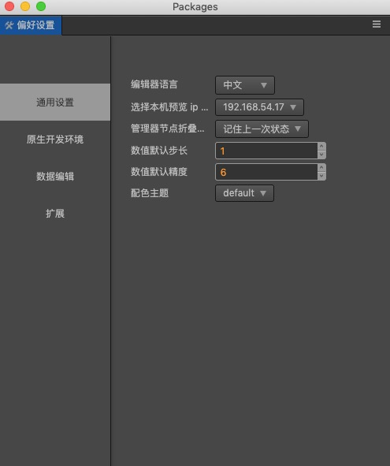

# 偏好设置

**偏好设置** 面板中提供了编辑器的个性化设置，要打开 **偏好设置** 面板，请从主菜单的 Cocos Creator 3D -> 偏好设置 菜单进入。

设置可以分成下列几部分：

## 通用设置

通用设置主要是针对编辑器相关的一些基础数据进行配置。

## 原生开发环境

原生开发环境内存储的是一些与引擎、开发、调试相关的配置信息。

## 数据编辑

数据编辑内存放的是一些与资源编辑、数据修改相关的配置。

## 扩展

插件内允许直接注入配置项目到偏好设置里。注册到偏好设置里的配置项就会显示在这里。
