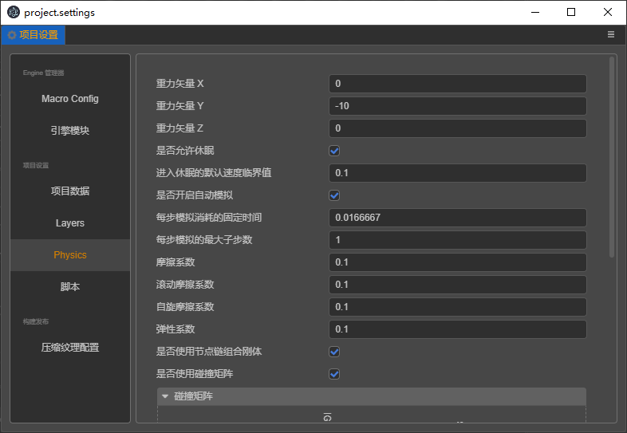

# 项目设置

项目设置 面板通过主菜单的 `项目 -> 项目设置` 菜单打开，这里包括所有特定项目相关的设置,这些设置将会影响到整个游戏项目的预览、构建等。这些设置会保存在项目的  `settings / packages` 文件夹里。如果需要在不同开发者之间同步项目设置，请将 settings 目录加入到版本控制。

## 通用设置


### 默认 Canvas 设置

默认 Canvas 设置包括设计分辨率和适配屏幕宽度/高度，用于规定在新建场景或 Canvas 组件 时，Canvas 中默认的设计分辨率数值，以及 `Fit Height、Fit Width` 选项。

更多内容可以参考 [多分辨率适配方案](../ui-system/components/engine/multi-resolution.md)

## 项目预览


`项目预览` 分页提供的选项主要用于设置初始预览场景等等，但只对当前项目生效。

### 保存场景后自动刷新

勾选后，只要保存场景，就会刷新所有预览打开的页面；

### 初始化预览场景

指定按下 `预览运行` 按钮时，会打开项目中哪个场景。如果设置为 `当前打开场景`，就会运行当前正在编辑的场景，此外也可以设置成一个固定的场景（比如项目总是需要从登录场景开始游戏）。

### 自定义设备数据

用于添加在预览时的设备信息，添加的设备信息将会出现在预览页面的设备选项里。


## 模块设置


这里的设置是针对发布游戏时引擎中使用的模块进行裁剪，达到减小发布版引擎包体的效果。在列表中选中的模块在打包时将被引擎包括，未选中的模块会被裁剪掉。

在这里设置裁剪能够大幅度的减小引擎包体，建议打包后进行完整的测试，避免在场景和脚本中使用裁剪掉的模块。

## 引擎设置


这里的设置与偏好设置内的引擎设置类似，不同的是这些设置是存储在项目本地的，在仅针对某个项目使用自定义引擎时可以在这里设置。

其中 javascript 引擎设置的修改将会影响到针对启动编辑器、预览、构建时的游戏，所以这个配置修改后需要重启编辑才会生效。

## Layers


- Layers 能让相机渲染部分场景，让灯光照亮部分场景。也可以在射线检测时通过 Layers 处理物体是否碰撞。
- 可自定义 0 到 19 个 Layers，当您把输入框清空时即删除原先的设置。
- 后 12 个 Layers 是引擎内置的，不可修改。
- 目前使用的位置有：编辑 node 节点时， inspector 面板上的 Layer 属性; 编辑 Camera 节点时的 Visibility 属性。


<!-- native 引擎设置的修改主要影响的是构建原生项目时使用 cocos2dx 引擎模板，修改后可以实时生效。 -->

## Physics 物理设置



启用的前提条件：在项目设置的引擎模块中勾选 Physics 选项


物理配置将会在项目预览和项目发布的代码中使用，物理效果体现在控制重力，摩擦力，动能传递，检测碰撞等方面。

### 属性说明：
- gravity 重力矢量，正负数值体现了方向性。默认值 { x: 0, y: -10, z: 0 }。
- allowSleep 是否允许休眠，默认值 true
- sleepThreshold 进入休眠的默认速度临界值，默认值 0.1，最小值 0
- autoSimulation 是否开启自动模拟
- fixedTimeStep 每步模拟消耗的固定时间，默认值 1/60，最小值 0
- maxSubSteps 每步模拟的最大子步数，默认值 1，最小值 0
- friction 摩擦系数，默认值 0.5
- rollingFriction 滚动摩擦系数，默认值 0.1
- spinningFriction 自旋摩擦系数，默认值 0.1
- restitution 弹性系数，默认值 0.1
- useNodeChains 是否使用节点链组合刚体，默认值 true
- useCollsionMatrix  是否使用碰撞矩阵，默认值 true

### 碰撞矩阵

碰撞矩阵默认使用内置 Layers ，顺排作为横轴 x, 逆排作为竖轴 y，勾选表示 x 轴的项与 y 轴的项有交叉，有碰撞的意思，
不勾选表示不碰撞。


默认都勾选，所以默认值都为 -1 (0xffffffff)，转为可视化的 32 位字符为 "11111111111111111111111111111111",  

运算规则为：
- value = -1;
- 勾选 value |= x
- 不勾选 value &= ~x
结果记录以 y 轴的 Layer 值为 key 键名 , value 为键值，示例记录数据如下图。


```
collisionMatrix = {
    1: -1, // First
    1048576: -1,
    2097152: -1,
    4194304: -1,
    8388608: -1,
    16777216: -1,
    33554432: -1,
    268435456: -1,
    1073741824: -2 // Default
}
```

示例中增加了一个自定义的 Layer (First) 以增加示例内容


## 骨骼贴图布局设置

显式指定骨骼贴图布局，用于辅助蒙皮模型的 instancing，具体参考 [这里](joints-texture-layout.md)。
