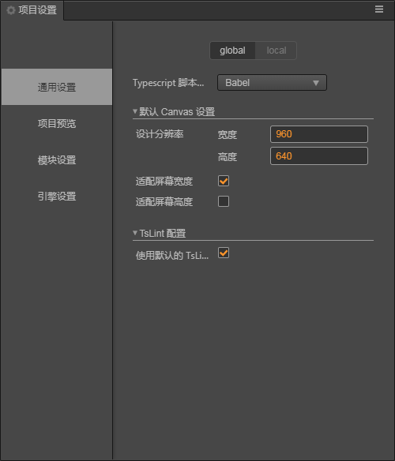

# 项目设置

**项目设置** 面板通过主菜单的 项目 -> 项目设置 菜单打开，这里包括所有特定项目相关的设置。

项目设置分为全局设置和本地设置。

全局设置存放在 $HOME/profiles/packages/project-settings.json
本地设置存放在 $PROJECT/profies/packages/project-settings.json
我们可以通过每个菜单页面顶部的 local 进入本地配置，并且去除 Use Global 选项来使用本地项目配置。

如果需要在不同开发者之间同步项目设置，请将 $PROJECT/profies/packages/project-settings.json 目录加入到版本控制。
并且在每个编辑器上，去除 Use Global 选项，强制使用本地配置。

## 通用设置

通用设置主要是针对项目全局的一些基础数据进行配置。

## 项目预览

预览相关的一些配置信息。

## 模块设置

构建发布引擎的时候，打包进入最终发布包内的引擎模块设置。

## 引擎设置

自定义引擎、引擎内可选择的模块的一些配置。
