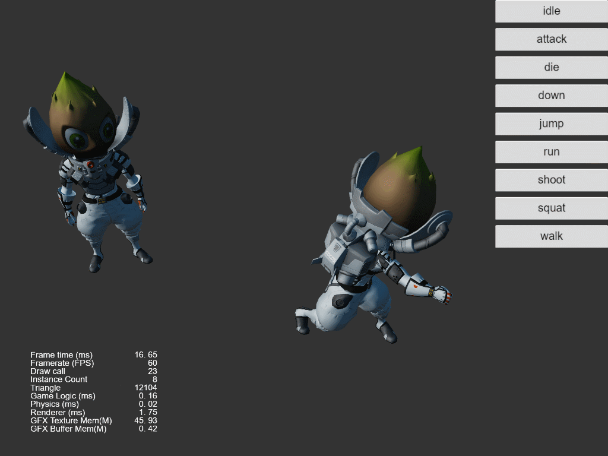
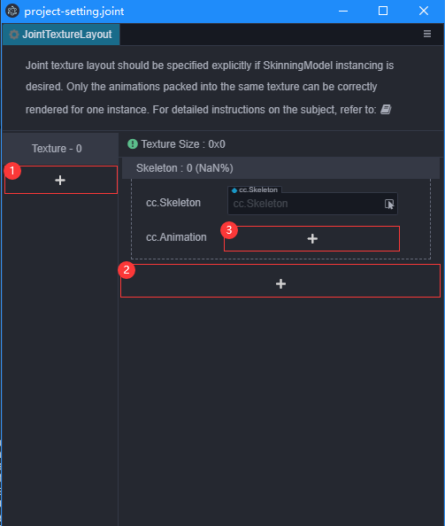
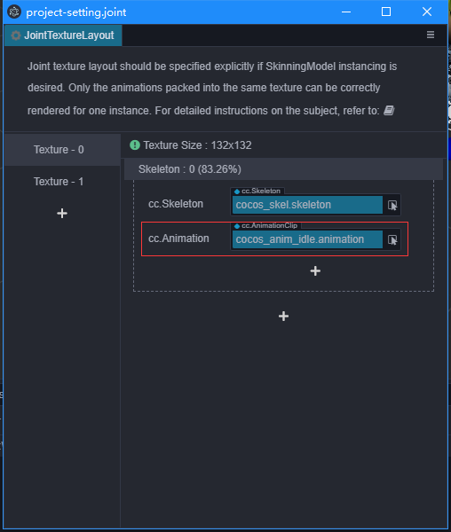
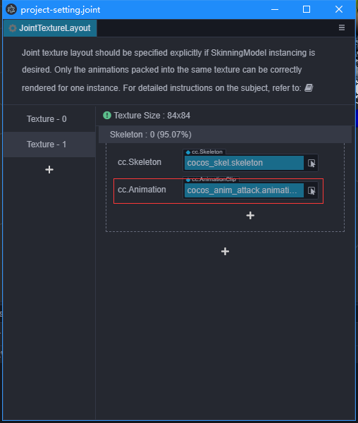
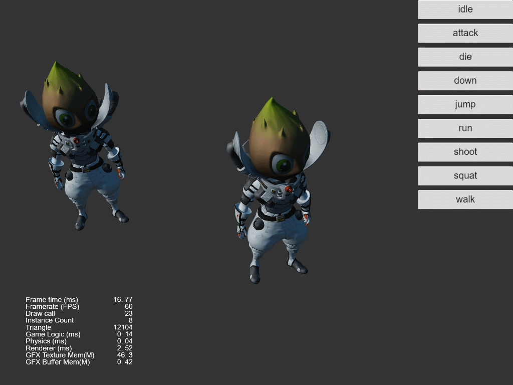

# 骨骼贴图布局设置

要确保[骨骼动画](../../engine/animation/skeletal-animation.md#关于动态-Instancing)也能够完全正确地参与[动态 Instancing](../../engine/renderable/model-component.md#Instancing-合批)，需要用户手动指定每张骨骼贴图的数据分配方式。

比如一个场景中要绘制大量相同的人物角色，每个角色可能在走，可能在坐着，可能在睡觉。如果希望能够一个 drawcall 能正确完成所有角色的绘制，一个重要的前提条件是，这三个动画的数据都储存在同一张骨骼贴图内。目前在默认的[预烘焙骨骼动画模式](../../engine/animation/skeletal-animation.md#预烘焙骨骼动画系统)下，骨骼贴图已经做到全局自动复用，但每张贴图的大小和它们各储存哪些动画是不可预知的。如果不做任何处理直接开启蒙皮模型的 instancing 的话，体现在最终的运行时效果就是，有的动画效果正确，有的动画效果完全错乱，并且完全无法预测。因此我们引入骨骼贴图布局设置面板，用于手动指定每张骨骼贴图里，要存储哪些骨骼的哪些动画信息。

> 注意：骨骼贴图布局设置面板提供的，本质上是运行时的“内存分配指导规则”。对于指定的骨骼和动画资源，会保证按照指定规则分配，但如果运行时用到了并未指定规则的资源，还是会回到全局复用的自动分配模式上去。

下面我们以 Cocos宇航员模型 为例，展示设置流程。

1. 我们先都设置规则，因为只有一个骨骼和动画，所以这些动画就自动的尽可能的打在一张贴图上，我们会看到动画的表现是正常的。后面几步将展示如果将同一个骨骼的动画放到不同的贴图上会发生什么。

    

2. 首先我们通过菜单 `Panel->Animation->Joint Texture Layout`  打开骨骼贴图布局设置面板。
   
   

   - 点击①中的加号，可以增加一个Texture，一个Texture由多个Skeleton组成。
   - 点击②中的加号，可以增加一个Skeleton，一个Skeleton由一个cc.Skeleton和一至多个cc.Animation组成。
   - 点击③中的加号，可以增加一个cc.Animation。

3. 将idle动画和attack动画放到不同的Texture中。
   
   

   

4. 此时我让前面的模型播放attack动作，后面的模型保持idle动作。
   
   

    可以看到此时的gpu instancing效果不对，因为当我点击播放attack动作时，两个模型将会使用包含attack动作的那张贴图，两个动画在贴图中索引的起始位置正好相同，但idle的动画时长比attack大，所以用idle的时长去播放attack动画就会出现播放完就消失的问题。
   
因此在使用GPU Instancing时注意好贴图的的布局，尽量让同一个模型要同时播放的动作在一张贴图里。