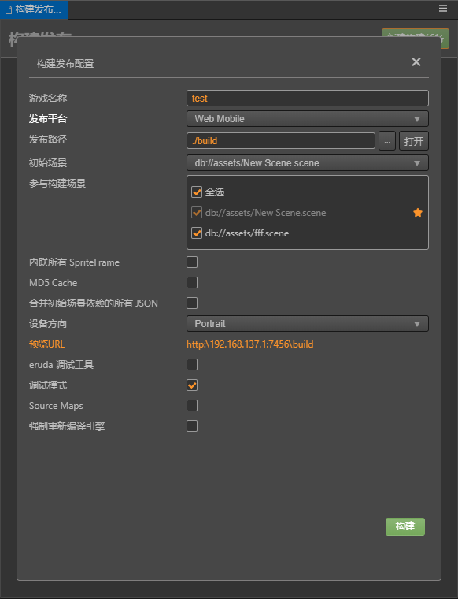
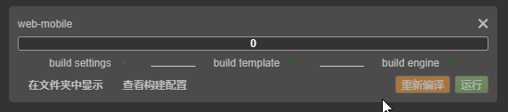

# 熟悉构建发布面板与常用构建参数

## 构建发布面板使用简介
点击主菜单中的`项目` -> `构建发布` 即可打开构建发布面板，构建发布是以构建任务的形式进行，可以同时进行多个平台的构建任务。由于引擎的复用是以平台作为区分的，所以**不支持同一平台同时构建，但可以给同一平台添加多个构建任务**。如果同时添加了多个同一平台的构建任务，编辑器将会按照任务添加的先后顺序，在该平台的构建任务完成后自动开始继续构建下一个任务。

点击右上方的 **新建构建任务** 按钮，即可打开构建参数配置面板，在该区域内填写好相关的构建参数，点击构建即可。当然没有场景的项目构建是没有意义的，因而空场景的项目是不允许添加构建任务的。



点击构建后，可以在构建面板上看到当前的构建任务进行情况。构建进行中进度条将显示为黄色，如果构建成功，进度条会显示为绿色，并且每个子任务后都会有 √ 的标识。第一次构建的时候，引擎编译会比较慢请耐心等待。如果构建失败，进度条则会显示为红色，对应失败的子任务后会显示红色的感叹号。



构建完成后，点击运行即可预览构建后的项目效果。

在编辑器内构建过的构建任务信息，将会保存在项目目录下的 `profiles/packages/build.json` 里，只要没有在面板上删除对应构建任务或者删除对应的实体文件，就可以在重新打开编辑器后查看之前构建的参数配置、运行预览等操作。

## 通用构建参数介绍

### 发布路径

通过在 **发布路径** 的输入框中输入路径或者通过 `...` 浏览按钮直接选择，我们可以为游戏指定一个发布路径，后续的多平台发布都会在这个发布路径中的子文件夹中创建资源或工程，发布后的文件夹名称会与构建任务对应名称（参见构建进度条项左上角）一致，。

默认的发布路径在项目文件夹下的 `build` 文件夹中，如果您使用 git、svn 等版本控制系统，可以将 `build` 文件夹在版本控制中忽略。

### 调试模式
在发布模式下，将会对资源的 uuid 、构建出来的引擎脚本与项目脚本进行压缩和混淆，并且将对同类资源的 json 做分包处理，减少资源加载的次数。在需要对项目进行调试处理时，建议勾上此项方便定位问题。

### 参与构建的场景
在构建过程中，除 `resources` 内的资源和脚本会全部打包出来外，其他资源都是根据参与构建的场景的使用情况来按需打包的。因而不勾选不需要发布的场景，可以减少构建后的包体体积。

### Source Maps
构建默认会对引擎文件和项目脚本做压缩处理，如果需要生成 sourcemap 需要勾选此项。

### 内联所有 SpriteFrame

自动合并资源时，将所有 SpriteFrame 与被依赖的资源合并到同一个包中。建议网页平台开启，启用后会略微增大总包体，多消耗一点点网络流量，但是能显著减少网络请求数量。建议原生平台关闭，因为会增大热更新时的体积。

### 合并初始场景依赖的所有 JSON

自动合并资源时，将初始场景依赖的所有 JSON 文件都合并到初始场景所在的包中。默认关闭，启用后不会增大总包体，但如果这些 JSON 也被其它场景公用，则后面再次加载它们时 CPU 开销可能会稍微增加。

### MD5 Cache

给构建后的所有资源文件名将加上 MD5 信息，解决 CDN 资源缓存问题。
启用后，如果出现资源加载不了的情况，说明找不到重名后的新文件。这通常是因为有些第三方资源没通过 cc.loader 加载引起的。这时可以在加载前先用以下方法转换 url ，转换后的路径就能正确加载。

```js
url = cc.loader.md5Pipe.transformURL(url);
```

### Eruda

插入 Eruda 调试插件，Eruda 类似 DevTools 的迷你版，用于辅助调试。

如果需要调试，也可以开启 **调试模式** 和 **Source Maps** 的选项，这样构建出的版本会保留 sourcemap。