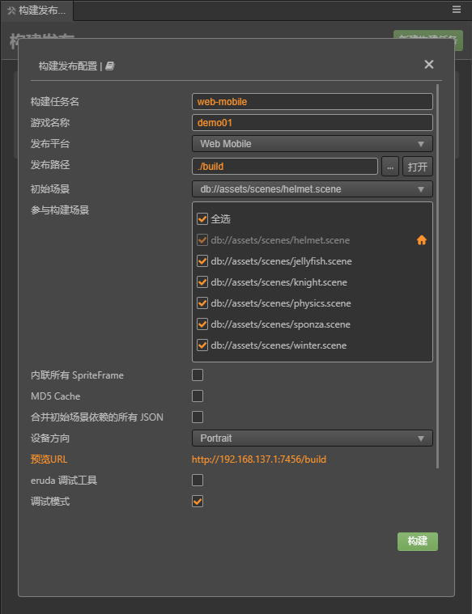

# 熟悉构建发布面板

## 构建发布面板使用简介

点击主菜单中的 `项目` -> `构建发布` 或者使用快捷键 `Ctrl / Cmd + Shift + B` 即可打开构建发布面板，构建发布是以构建任务的形式进行，可以同时进行多个平台的构建任务。由于引擎的复用是以平台作为区分的，所以**不支持同一平台同时构建，但可以给同一平台添加多个构建任务**。如果同时添加了多个同一平台的构建任务，编辑器将会按照任务添加的先后顺序，在该平台的构建任务完成后自动开始继续构建下一个任务。

## 平台插件相关选项

自 v1.0.3 起 ，所有的平台构建相关都内置为插件，这同时也是在为`构建插件`功能做内测，在将来稳定之后，我们将会开放给用户来方便对项目构建做一些定制化的插件。

因而自 v1.0.3 起，构建界面的显示有所不同，平台相关的选项会单独的放在一个可折叠的 section 控件内，将来构建插件开放后，也允许用户插件用类似的方式注入界面选项，上面的名字便是插件名，在菜单里的 `扩展-插件管理器` 可以看到对应的平台插件。

## 新建构建任务

点击右上方的 **新建构建任务** 按钮，即可打开构建参数配置面板，在该区域内填写好相关的构建参数，点击构建即可。
在点击构建之前，请确保当前的场景数据没有未保存的内容。当前场景有内容尚未保存，点击构建后构建将会弹框提示，可以选择保存场景数据、忽略或取消构建。选择保存和忽略都会继续进行构架，而取消构建则会生成一条被取消的构建记录。
>注：没有场景的项目构建是没有意义的，因而空场景的项目是不允许添加构建任务的。

其中构建参数的第一项，**构建任务名，将会作为实际打包后的包体文件夹命名**，默认是无需修改的，当需要覆盖旧有的包体文件夹时可以改成其他名字。

>注：Cocos Creator 构建后是使用平台作为包体名称，并且构建默认会覆盖原来打包后的内容。而 Cocos Creator 3D 是将构建任务名称作为包体名称，允许更改，默认会使用和现有包体不一样的名字作为构建任务名，手动修改为同名后可覆盖原包体。

构建面板中的导出选项可将当前配置导出为 json 配置文件，导入选项可读取配置文件到构建设置，方便用户保存构建配置信息。

## 构建进度查看

点击构建后，可以在构建面板上看到当前的构建任务进行情况。如果构建成功，进度条会显示为绿色，并且会输出实际构建时间。第一次构建的时候，引擎编译会比较慢请耐心等待。如果构建失败，进度条则会显示为红色。

构建完成后，点击`运行`按钮即可预览构建后的项目效果，需要注意的是编辑器第一次运行微信项目时需要先配置微信开发者工具的路径并且做好一系列的登录配置工作才能正常唤起，具体可以参照编辑器控制台的提示处理。

## 构建 Log 信息查看

由于构建过程会产生非常多的 log 记录，默认情况下只有错误信息会打印到编辑器自带的控制台内。

如果需要查看到所有的日志信息有以下操作方式：

- **打开构建调试工具**

    通过点击菜单 `开发者 -> 打开构建调试工具`，即可查看在构建过程中打印出的全部 log 信息包括调用栈。

- **调整日志等级**

    点击菜单里的 `Cocos Creator 3D -> 偏好设置 -> 插件` ，切换到 `builder` 来调整控制台打印相关信息的日志等级。

    

- **打开构建日志记录文件**

    自 v1.0.3 起，会记录每次构建过程中产生的报错信息，点击构建任务的按钮即可查看，在向论坛反馈构建相关问题时，可以直接贴上该 log 文件。

    这里的 log 文件会存储在项目目录下的 `temp/build-log` 文件夹内。

## 构建参数查看

面板上的构建任务都会有一个 `查看构建配置` 按钮，点击即可查看之前构建的参数配置情况。
在编辑器内构建过的构建任务信息，将会保存在项目目录下的 `profiles/packages/build.json` 里，只要没有在面板上删除对应构建任务或者删除对应的实体文件，就可以在重新打开编辑器后查看之前构建的参数配置、运行预览等操作。

**注意**：查看面板的修改操作是为了方便用户调整参数后重新构建，如果没有点击重新构建，修改的内容只会作为下一次新建构建任务时的显示数据，查看的始终是上一次构建的配置参数，这个按钮打开的面板虽然和新建类似但是意义不同，请不要混淆。

同时，点击构建构建后，编辑器也将打印出当前构建的参数内容，可以作为命令行构建的参数配置参考。

## 导出构建配置

这个功能最主要是为了方便**命令行构建**以及同个项目内对构建配置共享导出的构建参数是按照平台来划分的，对于有命令行构建需求的用户可以直接将这份配置文件作为命令行构建参数的 "configPath" 来使用。

## 重新编译

经常在打包后，会想要更改之前配置参数或者是之前的项目内 bug 修复后希望重新构建。而构建面板这边提供了两种重新编译的入口.

- 一种是直接在构建任务上，点击将会直接复用之前的构建配置参数进行重新构建。

- 另一种则是在点击 `查看构建配置参数` 后也会有 `重新构建` 的按钮出现。不同的是，后一种构建任务名与构建平台以外参数是不能修改的因为这会影响到实际的生成目录，并且直接修改重新构建面板的数据而没有重新构建，是不会保存到实际构建任务内的。
