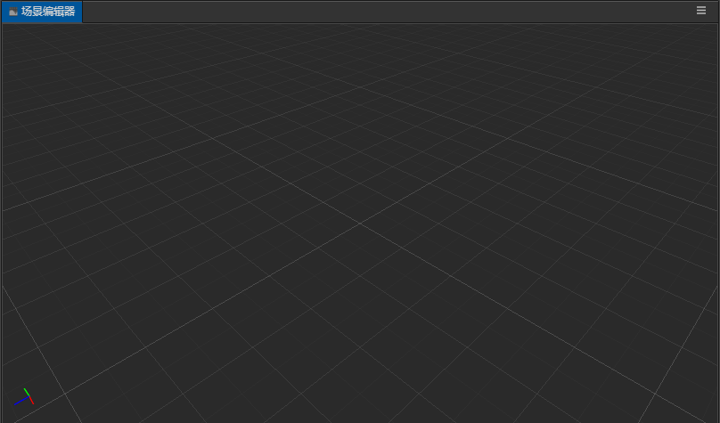

# 场景编辑器

**场景编辑器** 是内容创作的核心工作区域，您将使用它选择和摆放场景图像、角色、特效、UI 等各类游戏元素。在这个工作区域里，您可以选中并通过 **变换工具** 修改节点的位置、旋转、缩放、尺寸等属性，并可以获得所见即所得的场景效果预览。

## 视图介绍
### 导航
3D视图和2D视图的导航方式有所不同，通过工具栏中的3D/2D按钮可以切换3D和2D视图，3D视图用于3D场景编辑，2D视图主要用于UI，Sprite等2D元素的编辑。
#### 3D视图
在3D视图下，您可以通过以下操作来移动和定位 **场景编辑器** 的视图：
- 鼠标左键+Alt：摄像机围绕视图中心点旋转。
- 鼠标中键：平移视图。
- 鼠标滚轮：摄像机前后移动。
- 鼠标右键+WASD：摄像机漫游。
- **F** 快捷键：摄像机聚焦到当前选中节点。

#### 2D视图
在2D视图下，您可以通过以下操作来移动和定位 **场景编辑器** 的视图：
- 鼠标中键：平移视图。
- 鼠标滚轮：以当前鼠标悬停位置为中心缩放视图。
- 鼠标右键：平移视图。
- **F** 快捷键：摄像机聚焦到当前选中节点。

### 坐标系和网格
场景中网格是我们摆放场景元素时位置的重要参考信息，关于坐标系和位置等节点属性的关系，请阅读 [坐标系和变换](../../concepts/scene/coord.md) 一节

## 选择节点
在场景视图中点击鼠标左键选择物体所在节点，选择节点是使用变换工具设置节点位置、旋转、缩放等操作的前提。

## Gizmo 操作简介
**场景编辑器** 的核心功能就是以所见即所得的方式编辑和布置场景中的可见元素，我们主要通过 **Gizmo** 工具来辅助完成场景的可视化编辑。

- [变换工具Gizmo](./transform-gizmo.md)
- [摄像机Gizmo](./camera-gizmo.md)
- [灯光Gizmo](./light-gizmo.md)
- [碰撞器Gizmo](./collider-gizmo.md)
- [粒子系统Gizmo](./particle-system-gizmo.md)

