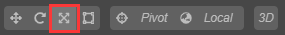
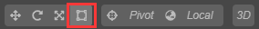

# 场景编辑器

**场景编辑器** 是内容创作的核心工作区域，您将使用它选择和摆放场景图像、角色、特效、UI 等各类游戏元素。在这个工作区域里，您可以选中并通过 **变换工具** 修改节点的位置、旋转、缩放、尺寸等属性，并可以获得所见即所得的场景效果预览。

## 视图介绍
### 导航
3D和2D的导航方式有所不同，通过工具栏中的3D/2D按钮可以切换3D和2D视图，3D视图用于3D场景编辑，2D视图主要用于UI，Sprite等2D元素的编辑。
#### 3D
在3D视图下，您可以通过以下操作来移动和定位 **场景编辑器** 的视图：
- 鼠标左键+Alt：摄像机围绕视图中心点旋转。
- 鼠标中键：平移视图。
- 鼠标滚轮：摄像机前后移动。
- 鼠标右键+WASD：摄像机漫游。
- **F** 快捷键：摄像机聚焦到当前选中节点。

#### 2D
在2D视图下，您可以通过以下操作来移动和定位 **场景编辑器** 的视图：
- 鼠标中键：平移视图。
- 鼠标滚轮：以当前鼠标悬停位置为中心缩放视图。
- 鼠标右键：平移视图。
- **F** 快捷键：摄像机聚焦到当前选中节点。

### 坐标系和网格
场景中网格是我们摆放场景元素时位置的重要参考信息，关于坐标系和位置等节点属性的关系，请阅读 [坐标系和变换](../../concepts/scene/coord.md) 一节

## 选择节点
在场景视图中点击鼠标左键选择物体所在节点，选择节点是使用变换工具设置节点位置、旋转、缩放等操作的前提。

## Gizmo 操作简介
**场景编辑器** 的核心功能就是以所见即所得的方式编辑和布置场景中的可见元素，我们主要通过Gizmo工具来辅助完成场景的可视化编辑。

### 变换工具Gizmo
我们主要通过主窗口工具栏左上角的一系列 **变换工具** 来将场景中的节点按我们希望的方式布置。

#### 移动变换工具

**移动变换工具** 是打开编辑器时默认处于激活状态的变换工具，之后这个工具也可以通过点击位于主窗口左上角工具栏第一个按钮来激活，或者在使用场景编辑器时按下快捷键 **W**，即可激活 **移动变换工具**。

选中任何节点，就能看到节点中心（或锚点所在位置）上出现了由红绿蓝三个箭头和红绿蓝三个方块组成的移动控制手柄

**控制手柄** 是指场景编辑器中在特定编辑状态下显示出的可用鼠标进行交互操作的控制器。这些控制器只用来辅助编辑，不会在游戏运行时显示。

移动变换工具激活时：
- 按住红色、绿色、蓝色箭头拖拽鼠标，将分别在 x、y、z 轴方向上移动节点；
- 按住红色、绿色、蓝色方块拖拽鼠标，将分别在 y-z平面、x-z平面、x-y平面上移动节点；

#### 旋转变换工具
点击主窗口左上角工具栏第二个按钮，或在使用场景编辑器时按下 **E** 快捷键，即可激活 **旋转变换工具**。

旋转变换工具的手柄主要是三个相互正交的圆组成（2D视图下由一个箭头和一个圆环组成）。拖拽圆环上任意一点就可以旋转节点，放开鼠标之前，可以在控制手柄上看到当前旋转的范围。

缩放变换工具激活时：
- 按住红色、绿色、蓝色圆圈拖拽鼠标，将分别在绕 x、y、z 轴旋转节点；

#### 缩放变换工具
点击主窗口左上角工具栏第三个按钮，或在使用场景编辑器时按下 **R** 快捷键，即可激活 **缩放变换工具**。

缩放工具由三个头部是正方体的坐标轴以及一个中心正方体组成。

缩放变换工具激活时：
- 按住红色、绿色、蓝色方块拖拽鼠标，将分别在 x、y、z 轴方向上缩放节点；
- 按住灰色方块拖拽鼠标，将同时在x、y、z轴上缩放节点；

#### 矩形变换工具
点击主窗口左上角工具栏第四个按钮，或在使用场景编辑器时按下 **T** 快捷键，即可激活 **矩形变换工具**。

矩形变换工具由四个顶点控制点、四个边控制点、一个中心控制点组成。

矩形变换工具激活时：
- 拖拽控制手柄的任一顶点控制点，可以在保持对角顶点位置不变的情况下，同时修改UI节点尺寸中的 width 和 height 属性。
- 拖拽控制手柄的任一边控制点，可以在保持对边位置不变的情况下，修改UI节点尺寸中的 width 或 height 属性。

在UI元素的排版中，经常会需要使用 矩形变换工具 直接精确控制节点四条边的位置和长度。而对于必须保持原始图片宽高比的图像元素，通常不会使用矩形变换工具来调整尺寸。

### 灯光Gizmo
有关Cocos3D的灯光信息可以查看[光源介绍](../../concepts/scene/light.md)
#### 方向光（Directional Light)
方向光Gizmo显示了当前方向光的方向

#### 球面光（Sphere Light)
球面光Gizmo显示了光源的颜色以及光源范围，同时可以使用方块控制点来编辑光源的范围。

#### 聚光（Spot Light）
聚光Gizmo显示了光源的颜色、光源范围以及聚光的角度，同时可以使用方块控制点来编辑光源的范围和角度。

### 碰撞器Gizmo
有关Cocos3D的碰撞器信息可以查看[物理介绍](../../physics/physics.md)
#### 盒碰撞器（Box Collider）
盒碰撞器Gizmo显示了盒子的长宽高，同时可以使用方块控制点来编辑长宽高。

#### 球碰撞器（Sphere Collider)
球碰撞器Gizmo显示了球的大小，同时可以使用方块控制点来编辑球的半径。

### 粒子系统Gizmo
粒子系统的Gizmo主要用于可视化粒子系统的[ShapeModule](../particle-system/emitter.md)
#### 方块（Box）
方块Gizmo显示了方块的长宽高，同时可以使用方块控制点来编辑长宽高。

#### 球（Sphere）
球Gizmo显示了球的大小，同时可以使用方块控制点来编辑球的半径。

#### 半球（Hemisphere）
半球Gizmo显示了半球的大小，同时可以使用方块控制点来编辑半球的半径。

#### 圆（Circle）
圆Gizmo显示了半球的大小，同时可以使用方块控制点来编辑圆的半径。

#### 圆锥（Cone）
圆锥Gizmo显示了圆锥的形状，同时可以使用方块控制点来编辑圆锥的半径、角度、高度。

### 摄像机Gizmo
摄像机Gizmo用于显示摄像机的裁剪范围，摄像机相关的信息可以查看[摄像机介绍](../../concepts/scene/camera.md)

#### 透视像机（Perspective）
透视摄像机Gizmo显示了由远近裁剪面，FOV，所构成的四棱台图形。可以使用方块控制点来编辑像机的远、近平面距离，FOV。

#### 正交像机（Ortho）
透视摄像机Gizmo显示了由远近裁剪面，正交高度，所构成的长方体图形。可以使用方块控制点来编辑像机的远、近平面距离，正交高度。

