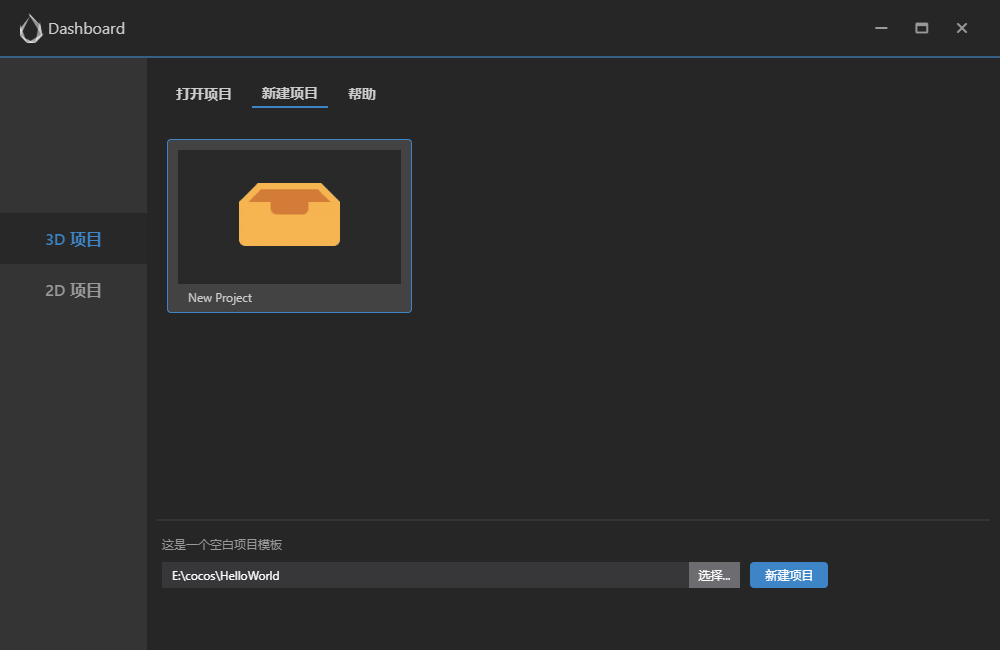
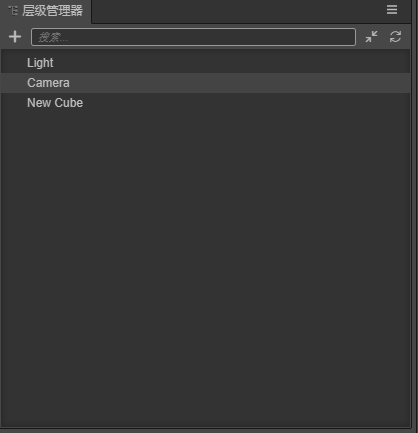
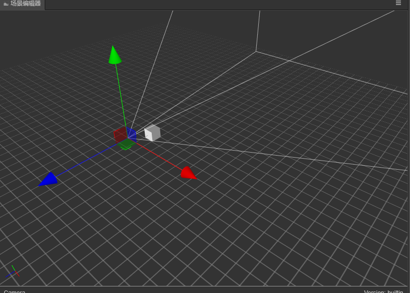
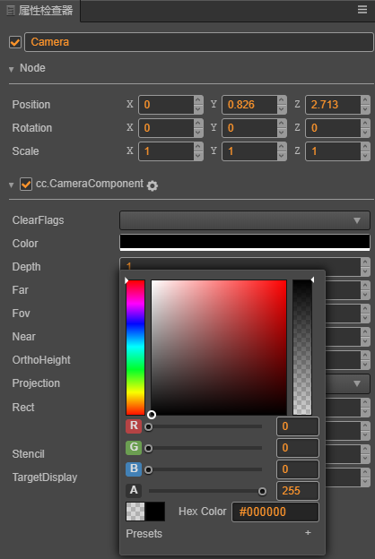

# Hello World项目
第一个cocos creator项目, 为您展示:
- 创建项目
- 了解工程目录
- 创建一个物体
- 修改相机属性
- 创建、修改、绑定脚本
- 运行及调试项目

## 新建项目

选择空的模板，设置项目路径，点击下方的新建项目按钮。

## 编辑器界面

## 工程目录
通常情况的我们只需要关心assets(资源目录)

- assets(资源目录)

- build(构建目录)

- library(导入的资源目录)

- local(日志文件目录)

- profiles(编辑器配置)

- temp(临时文件目录)

- package.json(项目配置)

## 新建场景

左下方资源管理器面板点击鼠标右键，选择新建->Scene。

## 创建物体

左上方层级管理器面板点击鼠标右键, 选择创建->3D对象->Cube 正方体。创建的正方体就会出现在场景编辑器里。

## 修改Camera

- 选择Camera对象
 在层级管理器面板，选择Camera，场景编辑器会选中它，并显示Gizmo。 

- 修改Camera位置
 在场景编辑器里，拖动Gizmo, 使Camera能够看到创建的正方体。 

- 修改Camera背景颜色
 在属性检查器面板，点击Color属性，选择黑色为背景色。 

## 添加脚本
- 新建脚本 
   在资源管理器面板点击鼠标右键，选择新建->JavaScript。 
  

- 生命周期函数
   - onLoad 
      脚本初始化时调用 
   - start 
      组件第一次激活时调用 
   - update 
      每一帧渲染前更新物体调用 
   - lateUpdate 
      在所有组件的 update 都执行完之后调用 
   - onDestroy 
      组件的 enabled 属性从 false 变为 true 时调用 
   - onEnable 
      组件的 enabled 属性从 true 变为 false 时调用 
   - onDisable 
      组件或者所在节点销毁时调用 
 
- 添加代码
     添加onLoad()函数，并输出Hello world 
        cc.Class({
        extends: cc.Component,

        properties: {
        // foo: {
            //     // ATTRIBUTES:
            //     default: null,        // The default value will be used only when the component attaching
            //                           // to a node for the first time
            //     type: cc.SpriteFrame, // optional, default is typeof default
            //     serializable: true,   // optional, default is true
            // },
            // bar: {
            //     get () {
            //         return this._bar;
            //     },
            //     set (value) {
            //         this._bar = value;
            //     }
            // },
        },

        // LIFE-CYCLE CALLBACKS:
        onLoad() {
            // 输出Hello world
            console.info('Hello world');
        },

        // start() {},

        // update(dt) {},
        });

- 为物体绑定脚本
 选择创建的正方体，在属性检查器面板点击添加组件->自定义脚本->HelloWorld 

## 运行项目
 编辑器菜单栏点击->项目->运行预览, 或者点击中间的运行按钮。 

## 调试项目
  点击编辑器菜单栏点击->开发者->打开场景调试工具 
 - 日志信息
  Console面板显示了所有日志输出 
 

 - 断点调试
    选择标签栏的Source选项，按下CTRL+P，搜索HelloWorld.js，在onLoad函数里设置断点，再运行预览时就可以调试了。 
   