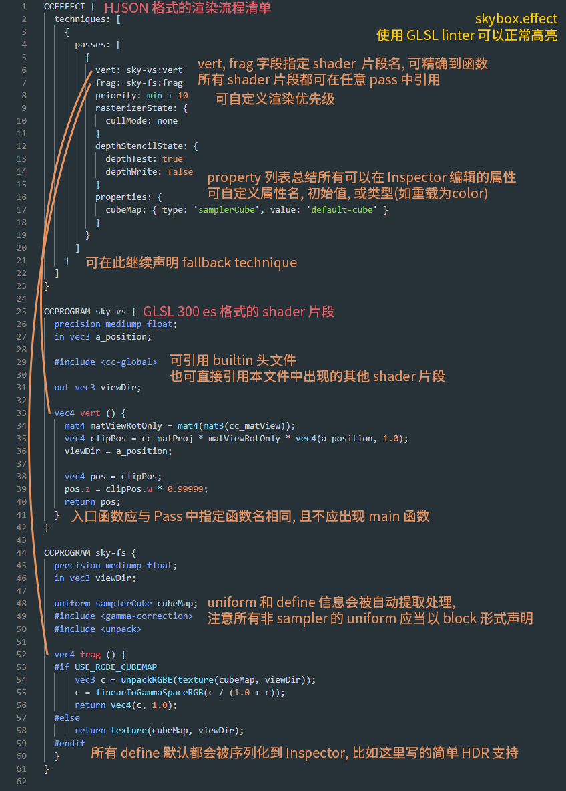

# Effect 语法

如果希望在引擎中实现自定义的着色效果, 需要书写自定义 Effect.<br>
Cocos Effect 是一种基于 YAML 和 GLSL 的单源码嵌入式领域特定语言 (single-source embedded domain-specific language)，<br>
YAML 部分声明流程控制清单, GLSL 部分声明实际的 shader 片段，这两部分内容上相互补充, 共同构成了一个完整的渲染流程描述。

## 语法框架
以 skybox.effect 为例, 这个 Effect 文件的内容大致是这样:



## 关于 YAML
YAML 是一门面向数据序列化的，对人类书写十分友好的语言，但它引入了一些独特的语法来表示不同类型的数据，<br>
对于不熟悉这门语言的开发者可能会有一点门槛，我们在 [这里](yaml-101.md) 快速总结了一下最常用的一些语法和语言特性，有需要可以参考。

## Pass 中可配置的参数
vert 和 frag 声明了当前 pass 使用的 shader, 格式为 `片段名:入口函数名`<br>
这个名字可以是本文件中声明的 shader 片段名, 也可以是引擎提供的标准头文件.
片段中不应出现 main 函数入口, 资源导入阶段会将指定入口函数的返回值赋值给当前 shader 的输出 (gl_Position 或最终的输出颜色).<br>
其他可配置 GL 参数及默认值见 [完整列表](pass-parameter-list.md).

## Shader 片段
Shader 片段在语法上基于 GLSL 300 ES, 在资源加载时有相应的预处理编译流程.

这一节会介绍所有的 “领域特定” 扩展语法, 更多实际使用示例, 可参考编辑器内提供的 builtin effect.

在标准 GLSL 语法上, 我们引入了一些非常自然的 C 风格语法扩展:

### Include 机制
类似 C 的头文件 include 机制, 可供引用的内置头文件都在 chunks 目录下, 主要包括一些常用的工具函数, 和标准光照模型等. 另外所有在当前 effect 文件中声明的 shader 片段都可相互引用.

### 预处理宏定义
目前 Effect 系统的设计倾向于在游戏项目运行时可以方便地利用 shader 中的各类预处理宏, 而减少 runtime branching。<br>
编辑器会在加载资源时收集所有在 shader 中出现的 defines, 然后引擎在运行时动态地将需要的声明加入 shader 内容。<br>
所以要使用这些预处理宏, 只需要如上面的例子中一样, 在 shader 中直接进行逻辑判断即可。<br>
所有的 define 都会被序列化到 inspector 上, 供使用者调整。<br>
注意目前运行时会显式定义所有 shader 中出现的自定义宏，所以除 GLSL 语言内置宏外（extension 等），请不要使用 #ifdef 或 #if defined() 这样的形式做判断，执行结果会始终为 true。

### Macro Tags
虽然我们会尝试自动识别所有出现在预处理分支逻辑中 (#if) 的宏定义，但有时实际使用方式要比简单的布尔开关更复杂一些，如：
```glsl
// macro defined within certain numerical 'range'
#if LAYERS == 4
  // ...
#elif LAYERS == 5
  // ...
#endif
// multiple discrete 'options'
float metallic = texture(pbrMap, uv).METALLIC_SOURCE;
```
针对这类有固定取值范围，或固定选项的宏定义，需要选择一个合适的 tag 显式声明：<br>

| Tag     | Tag 参数 | 默认值 | 说明 |
|:-------:|:---------:|:-------:|:------:|
| range   | 一个长度为 2 的数组，<br>首元素为最小值，末元素为最大值 | [0, 3] | 针对连续数字类型的宏定义，显式指定它的取值范围，<br>范围应当控制到最小，有利于运行时的 shader 管理 |
| options | 一个任意长度的数组，<br>每个元素都是一个可能的取值 | 如未显示声明则不会定义任何宏 | 针对有清晰选项的宏定义，<br>显式指定它的可用选项 |

比如下面这样的声明：
```glsl
#pragma define LAYERS range([4, 5])
#pragma define METALLIC_SOURCE options([r, g, b, a])
```
一个是名为 LAYERS 的宏定义，它在运行时可能的取值范围为 [4, 5]；<br>
另一个是名为 METALLIC_SOURCE 的宏定义，它在运行时可能的取值为 'r', 'g', 'b', 'a' 四种。<br>
注意语法中每个 tag 只有一个参数，这个参数可以直接用 YAML 语法去指定。

### Functional Macros
由于 WebGL1 不原生支持，我们将函数式预处理宏提供为资源导入期的功能：
```glsl
#define DECL_CURVE_STRUCT(name) \
  uniform int u_##name##_curveMode;
#define DECL_CURVE_STRUCT_INT(name) \
  DECL_CURVE_STRUCT(name) \
  uniform float u_##name##_minIntegral[MAX_KEY_NUM - 1];

DECL_CURVE_STRUCT_INT(velocity_pos_x)
```
对这样的声明，最后一行会在资源导入期就被展开变成:
```glsl
  uniform int u_velocity_pos_x_curveMode;
  uniform float u_velocity_pos_x_minIntegral[MAX_KEY_NUM - 1];
```

### Vertex Input<sup id="a1">[1](#f1)</sup>
为对接骨骼动画与数据解压流程，我们提供了 `CCVertInput` 工具函数，对所有 3D 模型使用的 shader，可直接在 vs 开始时类似这样写：
```glsl
#include <input>
vec4 vert () {
  vec3 position;
  CCVertInput(position);
  // ... do your thing with `position` (models space, after skinning)
}
```
如果还需需要法线等信息，可直接使用 standard 版本：
```glsl
#include <input-standard>
vec4 vert () {
  StandardVertInput In;
  CCVertInput(In);
  // ... now use `In.position`, etc.
}
```
这会返回模型空间的顶点位置（position）、法线（normal）和切空间（tangent）信息，并对骨骼动画模型做完蒙皮计算。<br>
注意引用头文件后，不要在 shader 内重复声明这些 attributes（a_position 等）。<br>
对于其他顶点数据（如 uv 等）还是正常声明 attributes 直接使用。

### Fragment Ouput<sup id="a1">[1](#f1)</sup>
为对接引擎渲染管线，我们提供了 `CCFragOutput` 工具函数，对所有无光照 shader，可直接在 fs 返回时类似这样写：
```glsl
#include <output>
vec4 frag () {
  vec4 o = vec4(0.0);
  // ... do the computation
  return CCFragOutput(o);
}
```
这样中间的颜色计算就不必区分当前渲染管线是否为 HDR 流程等。<br>
如需要包含光照计算，可结合标准着色函数 `CCStandardShading` 一起构成 surface shader 流程：
```glsl
#include <shading-standard>
#include <output-standard>
void surf (out StandardSurface s) {
  // fill in your data here
}
vec4 frag () {
  StandardSurface s; surf(s);
  vec4 color = CCStandardShading(s);
  return CCFragOutput(color);
}
```
在此框架下可方便地实现自己的 surface 输入，或其他 shading 算法；<br>
注意 `CCFragOutput` 函数一般还是不需要自己实现，它只起与渲染管线对接的作用，且对于这种含有光照计算的输出，因计算结果已经在线性空间，应包含 `output-standard` 而非 `output` 头文件。

### WebGL 1 fallback 支持
由于 WebGL 1 仅支持 GLSL 100 标准语法, 在资源导入阶段会提供 300 es 转 100 的 fallback shader, 用户基本不需关心这层变化。<br>
但注意目前的 fallback 只支持一些基本的格式转换，如果使用了 300 es 独有的 shader 函数（texelFetch、textureGrad 等）或 extension，<br>
我们推荐根据 \_\_VERSION__ 宏定义判断 shader 版本，自行实现更稳定精确的 fallback:
```glsl
#if __VERSION__ < 300
#ifdef GL_EXT_shader_texture_lod
  vec4 color = textureCubeLodEXT(envmap, R, roughness);
#else
  vec4 color = textureCube(envmap, R);
#endif
#else
  vec4 color = textureLod(envmap, R, roughness);
#endif
```
在资源导入期我们就会解析 \_\_VERSION__ 控制流，将实际内容拆分到不同版本的 shader 输出中。

### 关于 UBO 内存布局
首先结论是，我们规定在 shader 中所有非 sampler 的 uniform 都应以 block 形式声明，且对于所有 UBO：
* 不应出现 vec3 成员；
* 对数组类型成员，每个元素 size 不能小于 vec4；
* 不允许任何会引入 padding 的成员声明顺序。

这些规则都会在资源导入期做对应检查，以导入错误（implicit padding 相关）的形式提醒修改。

这可能听起来有些过分严格，但背后有非常务实的考量：<br>
首先，UBO 是渲染管线内要做到高效数据复用的唯一基本单位，离散声明已不是一个选项；<br>
其次，WebGL2 的 UBO 只支持 std140 布局，它遵守一套比较原始的 padding 规则：
* 所有 vec3 成员都会补齐至 vec4：
```glsl
uniform ControversialType {
  vec3 v3_1; // offset 0, length 16 [IMPLICIT PADDING!]
}; // total of 16 bytes
```
* 任意长度小于 vec4 类型的数组和结构体，都会逐元素补齐至 vec4：
```glsl
uniform ProblematicArrays {
  float f4_1[4]; // offset 0, stride 16, length 64 [IMPLICIT PADDING!]
}; // total of 64 bytes
```
* 所有成员在 UBO 内的实际偏移都会按自身所占字节数对齐（更详细的规则可以直接参考<sup id="a2">[2](#f2)</sup>）：
```glsl
uniform IncorrectUBOOrder {
  float f1_1; // offset 0, length 4 (aligned to 4 bytes)
  vec2 v2; // offset 8, length 8 (aligned to 8 bytes) [IMPLICIT PADDING!]
  float f1_2; // offset 16, length 4 (aligned to 4 bytes)
}; // total of 20 bytes
uniform CorrectUBOOrder {
  float f1_1; // offset 0, length 4 (aligned to 4 bytes)
  float f1_2; // offset 4, length 4 (aligned to 4 bytes)
  vec2 v2; // offset 8, length 8 (aligned to 8 bytes)
}; // total of 16 bytes
```

这意味着大量的空间浪费，且某些设备的驱动实现也并不完全符合此标准<sup id="a3">[3](#f3)</sup>，因此我们目前选择限制这部分功能的使用，以帮助排除一部分非常隐晦的运行时问题。<br>

再次提醒，uniform 的类型与 inspector 显示或运行时参数赋值时的程序接口可以不直接对应，通过 [property target](pass-parameter-list.md#Properties) 机制，可以独立编辑任意 uniform 具体的分量。

<b id="f1">[1]</b> 不包含粒子、sprite、管线内后处理等不基于 mesh 执行渲染的 shader [↩](#a1)<br>
<b id="f2">[2]</b> [OpenGL 4.5, Section 7.6.2.2, page 137](http://www.opengl.org/registry/doc/glspec45.core.pdf#page=159) [↩](#a2)<br>
<b id="f3">[3]</b> [Interface Block - OpenGL Wiki](https://www.khronos.org/opengl/wiki/Interface_Block_(GLSL)#Memory_layout) [↩](#a3)
