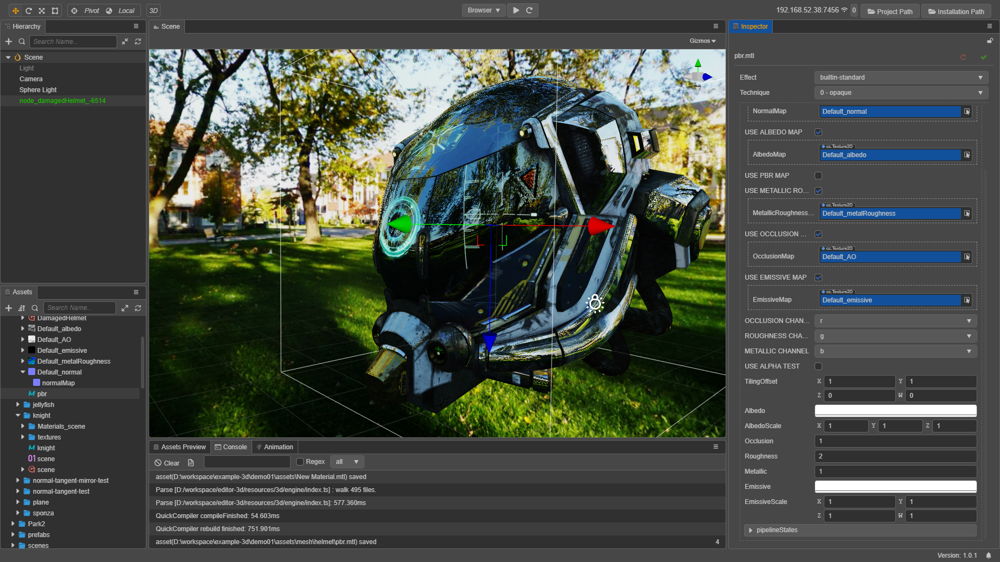

# 材质系统总览

材质系统控制着每个模型最终的着色流程与顺序, 在引擎内相关类间结构如下:
[](material.dot)

## EffectAsset
EffectAsset 是由用户书写的着色流程描述文件, 详细结构及书写指南可以参考[这里](effect-syntax.md).<br>
这里主要介绍引擎读取 EffectAsset 资源的流程:

在编辑器导入 EffectAsset 时, 会对用户书写的内容做一次预处理, 替换 GL 字符串为管线内常量, 提取 shader 信息, 转换 shader 版本等.<br>
还以 builtin-unlit.effect 为例, 编译输出的 EffectAsset 结构大致是这样的:
```json
{
    "name": "builtin-unlit",
    "techniques": [
      {"name":"opaque", "passes":[{"program":"builtin-unlit|unlit-vs:vert|unlit-fs:frag", "properties":{"mainTexture":{"value":"grey", "type":28}, "tilingOffset":{"value":[1, 1, 0, 0], "type":16}, "mainColor":{"value":[1, 1, 1, 1], "type":16}, "colorScale":{"value":[1, 1, 1], "type":15, "handleInfo":["colorScaleAndCutoff", 0, 15]}, "alphaThreshold":{"value":[0.5], "type":13, "handleInfo":["colorScaleAndCutoff", 3, 13]}, "color":{"type":16, "handleInfo":["mainColor", 0, 16]}, "colorScaleAndCutoff":{"type":16, "value":[1, 1, 1, 0.5]}}}]}
    ],
    "shaders": [
      {
        "name": "builtin-unlit|unlit-vs:vert|unlit-fs:frag",
        "hash": 3485766545,
        "glsl3": {
          "vert": "// glsl 300 es vert source, omitted here for brevity",
          "frag": "// glsl 300 es frag source, omitted here for brevity",
        },
        "glsl1": {
          "vert": "// glsl 100 vert source, omitted here for brevity",
          "frag": "// glsl 100 frag source, omitted here for brevity",
        },
        "builtins": {"globals":{"blocks":[{"name":"CCGlobal", "defines":[]}], "samplers":[]}, "locals":{"blocks":[{"name":"CCLocalBatched", "defines":["CC_USE_BATCHING"]}, {"name":"CCLocal", "defines":[]}, {"name":"CCSkinningTexture", "defines":["CC_USE_SKINNING"]}, {"name":"CCSkinningAnimation", "defines":["CC_USE_SKINNING"]}], "samplers":[{"name":"cc_jointsTexture", "defines":["CC_USE_SKINNING"]}]}},
        "defines": [
          {"name":"CC_USE_BATCHING", "type":"boolean"},
          {"name":"CC_USE_SKINNING", "type":"number", "range":[0, 2]},
          {"name":"USE_VERTEX_COLOR", "type":"boolean"},
          {"name":"USE_TEXTURE", "type":"boolean"},
          {"name":"FLIP_UV", "type":"boolean"},
          {"name":"CC_USE_HDR", "type":"boolean"},
          {"name":"USE_ALPHA_TEST", "type":"boolean"},
          {"name":"ALPHA_TEST_CHANNEL", "type":"string", "options":["a", "r", "g", "b"]}
        ],
        "blocks": [
          {"name": "TexCoords", "defines": ["USE_TEXTURE"], "binding": 0, "members": [
            {"name":"tilingOffset", "type":16, "count":1}
          ]},
          {"name": "Constant", "defines": [], "binding": 1, "members": [
            {"name":"mainColor", "type":16, "count":1},
            {"name":"colorScaleAndCutoff", "type":16, "count":1}
          ]}
        ],
        "samplers": [
          {"name":"mainTexture", "type":28, "count":1, "defines":["USE_TEXTURE"], "binding":30}
        ]
      }
    ]
  }
```
接着这个生成的 EffectAsset 正常参与标准(反)序列化流程.<br>
另外在反序列化时, 其中包含的 shaders 会被直接注册到 ProgramLib, 供运行时使用.

## Material
Material 资源可以看成是 EffectAsset 在场景中的资源实例, 它本身的可配置参数有:
* effectAsset 或 effectName: effect 资源引用, 使用哪个 EffectAsset 所描述的流程进行渲染? (必备)
* technique: 使用 EffectAsset 中的第几个 technique? (默认为 0 号)
* defines: 宏定义列表, 需要开启哪些宏定义? (默认全部关闭)
* states: 管线状态重载列表, 对渲染管线状态 (深度模板透明混合等) 有哪些重载? (默认与 effect 声明一致)

```ts
const mat = new Material();
mat.initialize({
  effectName: 'pipeline/skybox',
  defines: { USE_RGBE_CUBEMAP: true }
});
```
有了这些信息后, Material 就可以被正确初始化(标志是生成渲染使用的 Pass 对象数组), 用于具体模型的渲染了.

另外注意，**如果要在蒙皮模型 (Skinning Model) 上使用自定义材质，一定记得开启材质的 USE_SKINNING 宏定义开关。**

根据所使用 EffectAsset 的信息, 可以进一步设置每个 Pass 的 uniform 参数等.
```ts
mat.setProperty('cubeMap', someCubeMap);
console.log(mat.getProperty('cubeMap') === someCubeMap); // true
```
这些属性都是在材质资源对象本身内部生效, 还并不涉及场景.

Material 通过挂载到 RenderableComponent 上与场景连接, 所有需要设定材质的 Component (ModelComponent, SkinningModelComponent等) 都继承自它.
```ts
const comp = someNode.getComponent(ModelComponent);
comp.material = mat;
comp.setMaterial(mat, 0); // 与上一行作用相同
```
根据子模型的数量, RenderableComponent 也可以引用多个 Material 资源:
```ts
comp.setMaterial(mat, 1); // 赋给第二个 submodel
```

同一个 Material 也可挂载到任意多个 RenderableComponent 上, 一般在编辑器中通过拖拽的方式即可自动赋值. 而当场景中的某个模型的 Material 需要特化的设置, 会在从 RenderableComponent 获取 Material 时自动做拷贝实例化, 从而实现独立的定制.
```ts
const comp2 = someNode2.getComponent(ModelComponent);
const mat2 = comp2.material; // 拷贝实例化, 接下来对 `mat2` 的修改只会影响 `comp2` 的模型
```

对于一个已初始化的材质, 如果希望修改最初的基本信息, 可以直接再次调用 initialize 函数, 重新创建渲染资源.
```ts
mat2.initialize({
  effectName: 'builtin-standard',
  technique: 1
});
```

特别地, 如果只是希望修改 defines 或 states, 我们提供更高效的直接设置接口, 只需提供相对当前值的重载即可:
```ts
mat.recompileShaders({ USE_RGBE_CUBEMAP: false });
mat.overridePipelineStates({ rasterizerState: { cullMode: GFXCullMode.NONE } });
```

每帧动态更新 uniform 值是非常常见的需求, 在类似这种需要更高效接口的情景下, 可以手动调用对应 pass 的接口:
```ts
// 初始化时保存以下变量
const pass = mat2.passes[0];
const hColor = pass.getHandle('albedo');
const color = new Color('#dadada');

// 每帧更新时：
color.a = Math.sin(director.getTotalFrames() * 0.01) * 127 + 127;
pass.setUniform(hColor, color);
```

## Builtins
编辑器内置了几种常见类型的材质，无光照的 unlit、基于物理光照的 standard、skybox、粒子、sprite 等；<br>
这里列一下最常用的 standard 各项参数的意义和用法：



| Property | Info |
|:--------:|:----:|
| tilingOffset | 模型 UV 的平铺和偏移量，<br>xy 对应平铺，zw 对应偏移 |
| albedo/mainColor | 漫反射颜色，指定模型的主要基色 |
| albedoMap/mainTexture | 漫反射贴图，如果有指定，这项会和漫反射颜色相乘 |
| albedoScale | 模型的漫反射强度，<br>用于控制漫反射颜色对于最终颜色的影响权重 |
| alphaThreshold | 启用 alpha test 后的测试阈值，<br>输出 alpha 值低于此值的像素会被 discard 掉 |
| normalMap | 法线贴图，用于增加表面细节 |
| normalStrenth | 法线贴图强度，控制凹凸质感的强弱 |
| pbrMap | PBR 材质参数贴图：环境遮挡、粗糙度和金属度<br>采样结果会和常数项相乘<br>每种属性具体的来源通道由 XX_CHANNEL 宏定义决定 |
| metallicRoughnessMap | 独立的粗糙度和金属度贴图<br>采样结果会和常数项相乘<br>每种属性具体的来源通道由 XX_CHANNEL 宏定义决定 |
| occlusionMap | 独立的环境遮挡贴图<br>采样结果会和常数项相乘<br>每种属性具体的来源通道由 XX_CHANNEL 宏定义决定 |
| occlusion | 环境遮挡常数 |
| roughness | 粗糙度常数 |
| metallic | 金属度常数 |
| emissive | 自发光颜色<br>独立于光照计算的，模型本身直接发散出的颜色 |
| emissiveMap | 自发光贴图<br>如果有指定，这项会和自发光颜色相乘，<br>因此需要把自发光颜色（默认是黑色）调高才会有效果 |
| emissiveScale | 自发光强度<br>用于控制自发光颜色对于最终颜色的影响权重 |

相对应的，还有控制这些参数的宏定义：

| Macro | Info |
|:-----:|:----:|
| ROUGHNESS_CHANNEL | 指定粗糙度的数据来源通道，默认为 r 通道 |
| METALLIC_CHANNEL | 指定金属度的数据来源通道，默认为 g 通道 |
| AO_CHANNEL | 指定 AO 的数据来源通道，默认为 b 通道 |
| ALBEDO_UV | 指定采样漫反射贴图使用的 uv，默认为第一套 |
| EMISSIVE_UV | 指定采样自发光贴图使用的 uv，默认为第一套 |
| ALPHA_TEST_CHANNEL | 指定透明测试的测试通道 |
| USE_ALPHA_TEST | 是否开启透明测试（镂空效果）？ |
| USE_ALBEDO_MAP | 是否使用漫反射贴图？ |
| USE_NORMAL_MAP | 是否使用法线贴图？ |
| USE_PBR_MAP | 是否使用 PBR 材质参数贴图？ |
| USE_EMISSIVE_MAP | 是否使用自发光贴图？ |
