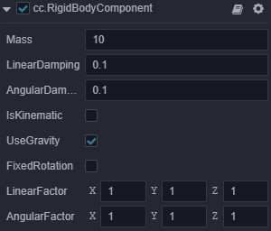

# 物理组件

Cocos Creator 3D 目前为用户提供了多种碰撞器组件和通用的刚体组件，以及工具类的恒力组件。

注：更多功能组件将会在后续版本持续发布，请留意版本更新公告。

## 碰撞器组件

碰撞器组件用于表示刚体的碰撞体形状，不同的几何形状拥有不同的属性。

**注：以下属性名称的首字母在实际代码中都为小写**。

### 盒碰撞器组件（BoxCollider）

  属性 | 解释
  ---|---
  **material** | 碰撞器引用的物理材质（为空时引用物理系统的默认物理材质）
  **isTrigger** | 是否为触发器，触发器不会产生物理反馈
  **center**  |  本地坐标系下形状的原点
  **size**  |  盒的大小，即长、宽、高

### 球碰撞器组件（SphereCollider）

属性 | 解释（其它参考盒碰撞器）
---|---
**radius** | 球的半径

### 圆柱体碰撞器组件（CylinderCollider）

属性 | 解释（其它参考盒碰撞器）
---|---
**direction** | 圆柱体延申方向的参考轴
**height** | 圆柱体的总高度
**radius** | 圆柱体两端圆面的半径

**注：`builtin`暂不支持圆柱体组件**。

### 胶囊体碰撞器组件（CapsuleCollider）

属性 | 解释（其它参考圆柱体和盒碰撞器）
---|---
**cylinderHeight** | 胶囊体中圆柱体的高度
**radius** | 胶囊体中球体的半径

**注：`cannon.js`不支持胶囊体组件，建议使用两个球和圆柱体拼凑**。

### 网格碰撞器组件（MeshCollider）

属性 | 解释（其它参考盒碰撞器）
---|---
**mesh** | 网格碰撞器引用的网格资源，用于初始化网格碰撞体

**注：`builtin`暂不支持网格碰撞器组件**。

**注：`cannon.js`对网格碰撞器组件支持程度很差，只允许与球碰撞器产生检测**。

**注：`ammo.js`目前只支持静态网格碰撞体（`mass`为`0`或无`RigidBody`组件的）**。

## 刚体组件（RigidBody）

为了更便捷的模拟物理行为，Cocos Creator 3D为用户提供了刚体组件，预览图如下：

属性 | 解释（上图的属性值都是默认值）
---|---
**mass** |  物体的质量（当质量为 0 时代表静态刚体，和不加刚体组件的效果一样）
**linearDamping** |  线性阻尼，用于减小物体的线性速率
**angularDamping** |  角阻尼，用于减小物体的旋转速率
**isKinematic** |   是否由用户来控制该刚体，而不受物理引擎的影响
**useGravity** |  是否受重力影响
**fixedRotation** |  碰撞时是否需要固定物体，而不产生旋转
**linerFactor** | 线性因数，可影响每个轴向的线性速度的变化
**angularFactor** | 旋转因数，可影响每个轴向的旋转速度的变化

**注：`builtin`暂不支持刚体组件**。

## 恒力组件（ConstantForce）

这是一个工具组件，它依赖刚体组件，将会在每帧对一个刚体施加给定的力和扭矩。

属性 | 解释
---|---
**force** |  在世界坐标系中对刚体施加的力
**localForce** |  在本地坐标系中对刚体施加的力
**torque** |  在世界坐标系中对刚体施加的扭矩
**localTorque** |   在本地坐标系中对刚体施加的扭矩

**注：`builtin`暂不支持恒力组件**。

---

继续前往 [物理使用](physics-use.md) 说明文档。
