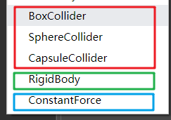

# 物理组件

Cocos Creator 3D 目前为用户提供了碰撞器和刚体组件。

红色框内的为碰撞器组件，绿色框内为刚体组件。

## 碰撞器组件

碰撞器组件用于指明游戏对象的形状，比如是球还是盒，不同的形状具有不同的属性，并且碰撞后的物理行为也截然不同，可以根据自己的需要选择相应的形状。目前 Cocos Creator 3D 已经为用户提供了球和盒形状的碰撞器组件。

**注：下面所列组件的属性名称的首字母在代码中实际都为小写**。

### 盒碰撞器组件（BoxColliderComponent）

  属性 | 解释
  ---|---
  **isTrigger** | 是否与其它碰撞器产生碰撞，并产生物理行为
  **center**  |  形状的中心点（与所在 Node 中心点的相对位置）
  **size**  |  盒的大小，即长、宽、高

### 球碰撞器组件（SphereColliderComponent）

属性 | 解释（其它参考盒碰撞器）
---|---
**radius** | 球的半径

## 刚体组件

为了更便捷的模拟物理行为，Cocos Creator 3D为用户提供了刚体组件，预览图如下：

属性 | 解释（上图的属性值都是默认值）
---|---
**mass** |  物体的质量
**linearDamping** |  线性阻尼，用于减小物体的线性速率
**angularDamping** |  角阻尼，用于减小物体的旋转速率
**isKinematic** |   是否由用户来控制该刚体，而不受物理引擎的影响
**useGravity** |  是否受重力影响
**fixedRotation** |  碰撞时是否需要固定物体，而不产生旋转
**linerFactor** | 线性因数，可影响每个轴向的线性速度的变化
**angularFactor** | 旋转因数，可影响每个轴向的旋转速度的变化

**注： Builtin 中此组件暂时无效**。

### [**继续下一篇**物理使用](physics-use.md)

### [**或者回到**物理简介](physics.md)
