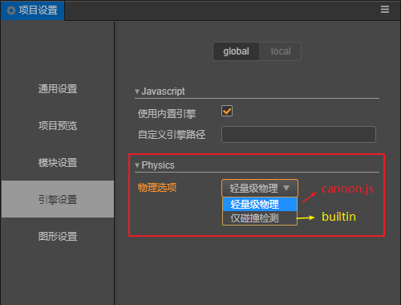

# 选择适合你项目的物理系统

在编辑器中选择 "项目->项目设置->引擎设置" 中，您可以选择适合您项目需求的物理引擎进行开发(新项目默认为 “轻量级物理”，即 Cannon.js 物理引擎)。如下图所示：

  

**注：开发过程中物理引擎可随意切换**。

## Builtin 碰撞检测系统

Builtin 是仅有碰撞检测系统的物理模块，相对于其它的物理引擎，它没有复杂的物理模拟计算，所以如果您的项目不需要这一部分的物理模拟，那么可以考虑使用 Builtin ，这将使得游戏的包体更小并且性能更佳。

## Cannon.js 物理引擎

[Cannon.js](https://github.com/cocos-creator/cannon.js) 是一个开源的物理引擎，它使用js语言开发并实现了比较全面的物理功能，如果您的项目需要更多复杂的物理功能，哪么您可以考虑使用 [Cannon.js](https://github.com/cocos-creator/cannon.js) ，再通过使用 Cocos3D 提供的 RigidBodyComponent 便可以快速上手。

## [**继续下一篇**物理组件](physics-component.md)

## [**或者回到**物理简介](physics.md)
