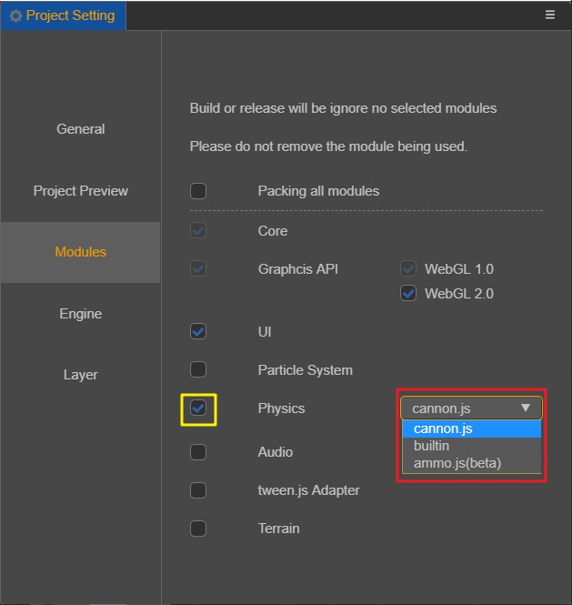

# 选择适合你项目的物理系统

在编辑器中选择 "项目->项目设置->模块选项" 中，您可以选择适合您项目需求的物理引擎进行开发(新项目默认为 Cannon.js 物理引擎)。如下图所示：

**注：开发过程中物理引擎可随意切换**。

## 碰撞检测 : Builtin

Builtin 是仅有碰撞检测系统的物理模块，相对于其它的物理引擎，它没有复杂的物理模拟计算，所以如果您的项目不需要这一部分的物理模拟，那么可以考虑使用 Builtin ，这将使得游戏的包体更小并且性能更佳。

若使用 Builtin 进行开发，请注意以下几点：

- Builtin 只有 trigger 类型的事件。

- ColliderComponent 中的 isTrigger 无论值真假，碰撞器都为触发器。

- ColliderComponent 中的 attachedRigidbody 为 null。

- RigidbodyComponent 无效。

## 物理引擎 : Cannon

[Cannon.js](https://github.com/cocos-creator/cannon.js) 是一个开源的物理引擎，它使用 js 语言开发并实现了比较全面的物理功能，如果您的项目需要更多复杂的物理功能，哪么您可以考虑使用 [Cannon.js](https://github.com/cocos-creator/cannon.js) ，再通过使用 Cocos Creator 3D 提供的 RigidBodyComponent 便可以快速上手。

## 物理引擎 : Ammo

[Ammo.js](https://github.com/cocos-creator/ammo.js) 是 [Bullet](https://github.com/bulletphysics/bullet3) 物理引擎的 asm.js / wasm 版本（目前仅提供了 asm.js 版本），由 [Emscripten](https://github.com/emscripten-core/emscripten) 工具编译而来，目前 Cocos Creator 3D 将使用的 Bullet 版本更新到了 2.87 版本。Bullet 具有完善的物理功能，未来我们也将在此投入更多工作。

需要注意的时，尽管我们对导出的接口进行了筛检，但是目前导出的 js 包体仍然具有 1 MB 的大小。

## 不使用物理

若不需要用到任何物理相关的组件和接口，可以将黄色框内的勾选取消，这样在发布时将有更小的包体。

**注：开发过程中可随意选择是否使用物理模块**。
**注：若处于取消勾选的状态，项目将不可以使用物理相关的组件和接口，否则运行时将会报错**。

<!-- ## 扩展物理后端 -->

---

继续前往 [物理系统](physics-system.md) 说明文档。
