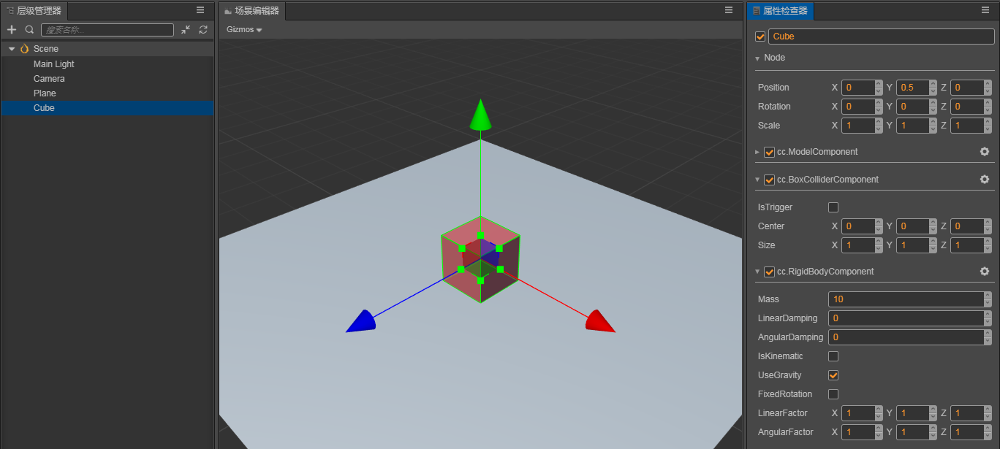

# 使用物理

得益于组件化的工作流程，在 Cocos3D 中使用物理是非常灵活和便捷的。

## 使用组件

### 在世界中添加一个物理元素可以分为以下步骤：

1. 新建一个形状 Cube；
2. 在右侧 Inspector 面板上点击“添加组件”
3. 在 Component 目录下选择 BoxColliderComponent, 并调整参数；
3. 为了使 Cube 具有物理行为，接着为 Cube 添加一个 RigidBodyComponent 组件，并调整参数。

这样，便有了一个既有碰撞器又有物理行为的一个物理元素。

### 完善物理世界

接着，完善物理世界，可以为世界添加一个地面，仿照以上步骤，可以再添加一个只有碰撞器的 Plane；

然后，再调整摄像机的角度（选中摄像机，执行 Ctrl + Shift + F 可以对齐到屏幕）；

最后，点击运行按钮，便可以看到物理元素在场景世界上的变化。

如图所示：



**注：通过调整组件的属性值，直接点击刷新按钮，即可在刚刚运行的浏览器上看到新的预览**。

## 进一步了解和使用 ColliderComponent

### 获取 Collider 组件

Cocos3D 目前支持两种语言进行开发，分别为 JavaScript 和 TypeScript。

**注：TypeScript 具有良好的语法分析和类型提示，推荐使用 TypeScript 进行开发**。

以获取 BoxColliderComponent 为例，在 JavaScript 中可以用以下方式获取相应的Collider组件：

1. `this.getComponent('cc.BoxColliderComponent')`
2. `this.getComponent(cc.BoxColliderComponent)`

在 TypeScript 中可以用以下方式获取相应的Collider组件：

1. 上述 javascript 使用的方式
2. **`this.getComponent(BoxColliderComponent)`** (**推荐使用，提示导入时，注意导入位置为“ Cocos3D ”**)

**注：若无智能导入提示，请检查工作目录是不是在工程的顶层，以及是否使用较新的 Vs Code 编辑器**。

### 碰撞事件

Cocos3D 中的碰撞事件目前分为三种 onCollisionEnter、onCollisionStay、onCollisionExit，分别代表着碰撞开始，碰撞保持，碰撞结束。

监听碰撞事件，可以通过注册事件的方式来添加碰撞后的回调，以下步骤可以完成碰撞事件的监听：

1. 通过 `this.getComponent(ColliderComponent)` 获取到 `ColliderComponent`
2. 通过 `ColliderComponent` 的 `on` 或者 `once` 方法注册相应事件的回调

代码示例：

```
public start () {
    let Collider = this.getComponent(ColliderComponent);
    Collider.on('onCollisionStay', this.onCollision, this);
}

private onCollision (type: string, event: ICollisionEvent) {
    console.log(type, event);
}
```

**注：ColliderComponent 是所有碰撞组件的父类**。

### 设置碰撞器的分组和掩码

在 Cocos3D 中，物理组件提供了设置组和掩码的接口，以下代码示例介绍了所有的接口

首先获取组件
`const Collider = this.getComponent(ColliderComponent);`

#### 分组

- 设置位

    `console.log(Collider.getGroup());`

    获取分组位，默认为 0，即 1 << 0 表达式中的 0。

    `Collider.setGroup(1);`

    设置分组位，将会进行位操作，即 1 << v。

    **注：使用以上接口表示只存在一个组中**。

- 设置值

    `const group = 1 << 1 + 1 << 2;`
    `Collider.setCollisionFilterGroup(group);`

    设置分组值，十进制为 6，二进制为 110，可以看作这个group是 1 或 2 的。

    `Collider.getCollisionFilterGroup()`

    获取分组值，此示例中为 6 。

#### 掩码

- 设置位

    `Collider.setMask(1);`

    设置掩码位，此示例中将会把掩码值的第 1 位写为 1，其它位写为 0

    `Collider.addMask(2);`

    添加掩码位，这相对于进行了一个这样的操作：mask += 1 << 2，可以填入需要检测的组。

    `Collider.removeMask(2);`

    移除掩码位，这相对于进行了一个这样的操作：mask -= 1 << 2，可以填入不需要检测的组。

- 设置值

    `console.log(Collider.getCollisionFilterMask());`

    获取掩码值，默认为 1，即 1 << 0 表达式的结果。

    `const mask = 1 << 2 + 1 << 3;`
    `Collider.setCollisionFilterMask(mask);`

    设置掩码值，十进制位为 12，二进制为 1100，表示检测的为 2 或 3 组的。

**注：灵活使用分组和掩码可以减少额外检测的消耗**。

## 进一步了解和使用 RigidBodyComponent

### 休眠和唤醒刚体

代码示例：

```
const rigidBody = this.getComponent(RigidBodyComponent);
rigidBody.sleep(); // 休眠
rigidBody.wakeUp(); // 唤醒
```

### 让刚体运动起来

让刚体运动，需要改变刚体的速度，目前改变刚体的速度有以下几种方式：

#### 通过力

刚体组件提供了`applyForce`接口，签名为：`applyForce (force: Vec3, position?: Vec3)`。
根据牛顿第二定律`F = m * a`，对刚体某点上施加力，这样就有了加速度，随着时间变化，速度会随加速度变化，就会使得刚体运动起来。

代码示例：

```
const rigidBody = this.getComponent(RigidBodyComponent);
rigidBody.applyForce(new Vec3(200, 0, 0));
```

#### 通过冲量

刚体组件提供了`applyImpulse`接口，签名为：`applyImpulse (impulse: Vec3, position?: Vec3)`。
根据动量守恒的方程式 `F * Δt = m * Δv`，对刚体某点施加冲量，随着时间增加，但物体的质量是恒定的，速度就会产生变化，刚体就会运动起来。

代码示例：

```
const rigidBody = this.getComponent(RigidBodyComponent);
rigidBody.applyImpulse(new Vec3(5, 0, 0));
```

<!-- ##### 通过直接设置速度 // TODO -->

## [**回到**物理简介](physics.md)
