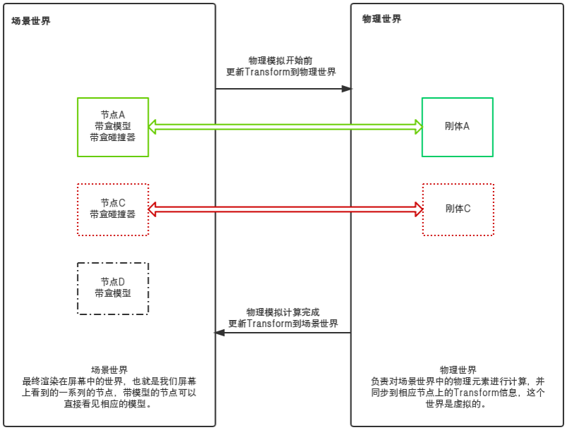
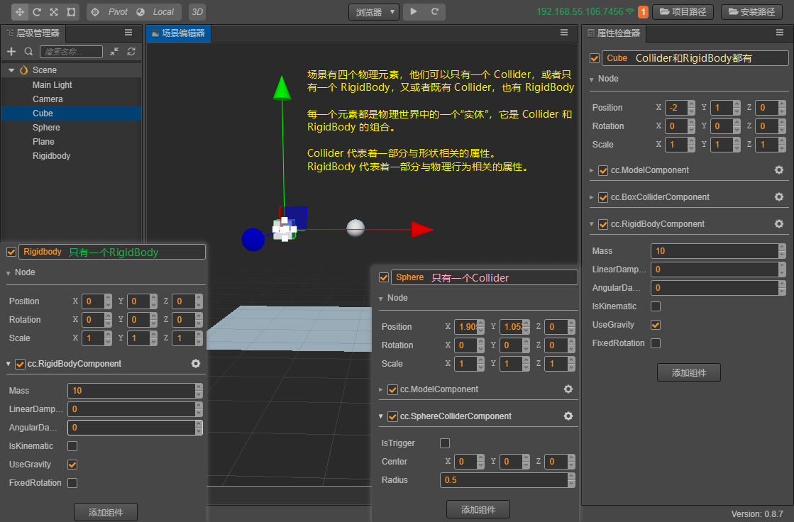

# 物理简介

Cocos3D 目前支持轻量的 Builtin 碰撞检测系统和具有物理模拟的 Cannon.js 物理引擎（后续还会接入更为强大的 Ammo.js），并为用户提供了高效的组件化工作流程和便捷的使用方法。

## 物理系统

物理系统（PhysicsSystem）是一个模拟真实物理行为的系统，它负责对物理世界中的元素进行物理计算，比如计算各物体是否产生碰撞，以及物体的受力情况。所有元素计算完成后，还会更新到场景世界中，从而使游戏对象产生相应的物理行为。

Cocos3D 中物理计算所处的流程 ：  所有 Update 结束后 → 物理计算 → 开始绘画

场景世界与物理世界，如图：
  

## 物理世界和元素

物理世界中的元素可以分为一个个的刚体，在 Cocos3D 中加入物理元素可以通过为游戏对象添加碰撞器（Collider）或者刚体（RigidBody）组件，物理系统将为这些元素进行物理计算，使其表现出真实世界下的行为。

**注：此处的“刚体”不是指刚体组件，刚体组件可控制刚体的物理行为相关的一部分属性**。

丰富多彩的物理元素，如图:
  

## 更详细的模块

Cocos3D 的物理系统的更多内容将通过以下模块来进行更详细的介绍：

模块 | 描述
---|---
[**物理选项**](physics-item.md) | 介绍了 Cocos3D 中可选的底层物理引擎选项
[**物理组件**](physics-component.md) | 介绍了一些列物理组件以及面板上的一系列属性
[**物理使用**](physics-use.md) | 进一步介绍了物理组件的使用

## [**继续下一篇**物理选项](physics-item.md)
