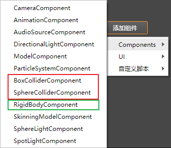
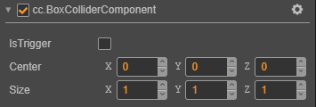
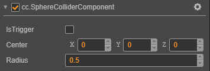
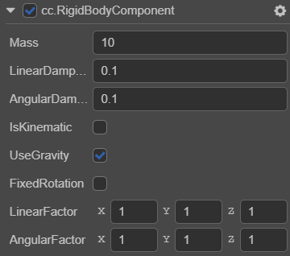

# 物理简介

Cocos3D目前已经接入了Cannon.js物理引擎，为用户提供了组件化工作流程和便捷、高效的使用方法。

## 物理系统

物理系统（PhysicsSystem）是一个模拟真实物理行为的系统，它负责对物理世界中的元素进行物理计算，比如计算各物体是否产生碰撞，计算物体的受力情况，所有元素计算完成后，还会更新到场景世界中，从而使游戏对象产生相应的物理行为。

物理计算的流程 ：  用户逻辑（即update和lateUpdate之后）   ->  物理计算  ->  渲染管线

## 物理元素

物理世界中的元素可以分为一个个的刚体，在Cocos3D中加入物理元素可以通过为游戏对象添加碰撞器（Collider）或者刚体（RigidBody）组件，物理系统将为这些元素进行物理计算，使其表现出真实世界下的行为。

注意：这里说的“刚体”不是指刚体组件，刚体组件是为了控制刚体中一部分通用的属性，这些属性与选择的形状（即碰撞器）无关。

## 物理组件

Cocos3D目前为用户提供了碰撞器和刚体组件。  
    
  红色框内的为碰撞器组件，绿色框内为刚体组件。

### 碰撞器组件

碰撞器组件用于指明游戏对象的形状，比如是球还是盒子，不同的形状具有不同的属性，并且碰撞后的物理行为也截然不同，用户可以根据自己的需要选择相应的形状，目前Cocos3D已经为用户提供了球和盒子形状的碰撞器组件。

* 盒子碰撞体组件（BoxColliderComponent）  
    
  属性详解：
  * Center  ：  形状的中心点（与游戏对象中心点的相对位置）
  * IsTrigger ：  是否与其它Collider产生碰撞，并产生物理行为
  * Size  ：  盒子的大小
   

* 球碰撞体组件（SphereColliderComponent）  
    
  属性详解（其它参考盒子）：
  * Radius  ：球的半径  

### 刚体组件

为了更便捷的模拟物理行为，Cocos3D为用户提供了刚体组件，预览图如下：  
  
属性详解：

* AngularDamping  ：  当受扭力旋转时物体受到的阻力
* FixedRotation  ：  碰撞时是否需要固定物体，而不产生旋转
* IsKinematic  ：   是否由用户来控制该刚体，而不受物理引擎的影响
* LinearDamping  ：  当受力移动时物体受到的阻力
* Mass  ：  物体的质量
* UseGravity  ：  是否受重力影响