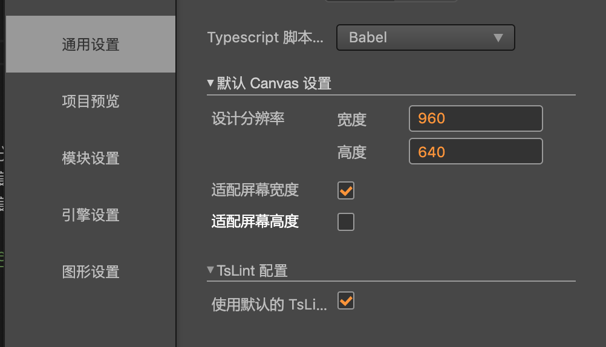

# Canvas（画布）组件参考

**Canvas（画布）**组件能够随时获得设备屏幕的实际分辨率并对场景中所有渲染元素进行适当的缩放。场景中的 Canvas 可以有多个，所有 UI 元素都必须在 Canvas 及其子节点下才能被渲染，Canvas 的设计分辨率和适配方案统一通过项目配置获取。

在编辑器的 ***项目/项目设置/通用配置***配置

<!-- 画布的脚本接口请参考[Canvas API](../../../api/zh/classes/Canvas.html)。 -->
