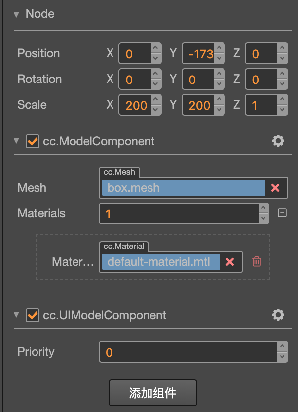

# UIModel 组件参考

UIModel 是一个将 3D 模型从 3D 渲染管线转换到 2D 渲染管线的一个带有转换功能的渲染组件。没有这个组件，即使模型节点在 UI 里也不会被渲染。

该组件的使用条件是将它添加到带有或继承自 ModelComponent 组件的节点上，通常它的结构如下：

## UIModel 属性

| 属性           | 功能说明                                                 |
| -------------- | -----------                                            |
| priority       | 跟其余渲染组件，如：LabelComponent，SpriteComponent 等做[渲染排序](../engine/priority.md)使用。      |

---

### [**其他渲染模块参考**](render-component.md)

### [**基础模块参考**](base-component.md)
