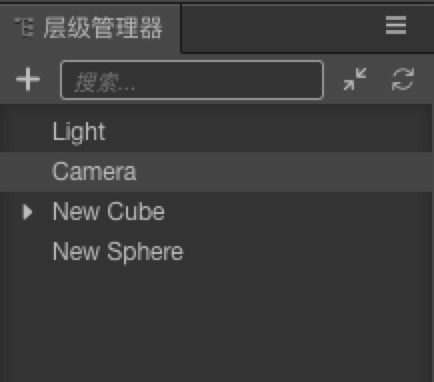
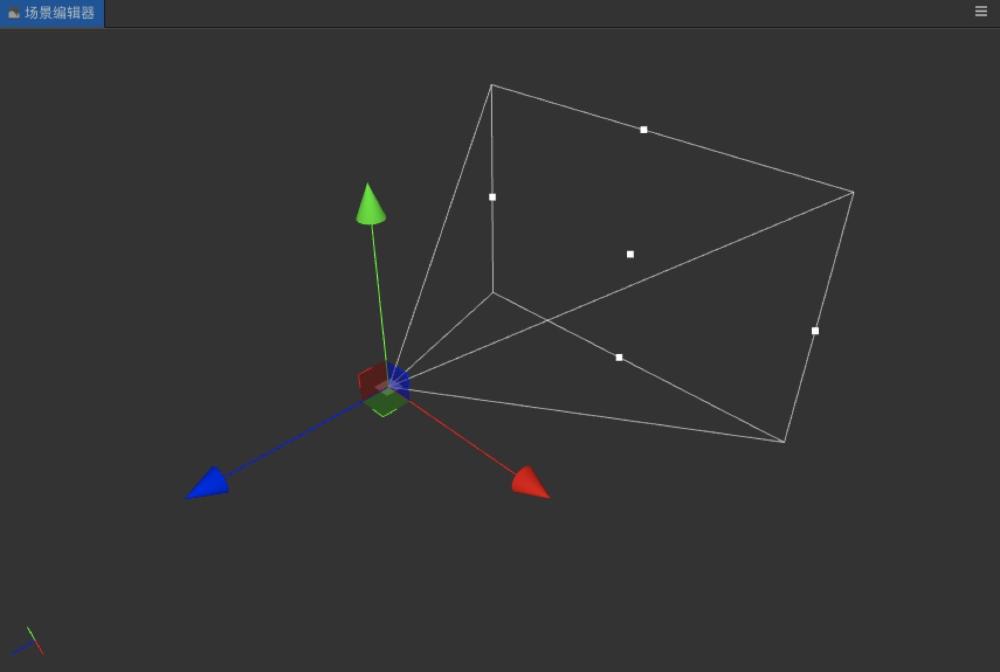

# 摄像机

## 摄像机设置

在新建工程后，层级管理器中会默认创建好一个摄像机（Camera），这是我们在游戏中使用的摄像机。

点选Camera后，在场景编辑器窗口中可以呈现出 **视锥体（Frustum）** 的可见范围，根据需要通过鼠标工具调整摄像机 Frutum 的可见范围，或是通过 **视口（Viewport）** 上的调节点调节 Viewport 的大小

还可以在属性检查器中调解摄像机的各种参数

## 创建摄像机

如果需要同时展现同一场景中的多个视口内容，您就需要创建多个相机。通过点击**层级管理器**中的 **+** ，然后选择**摄像机**，就可添加一个新的摄像机到场景中

**注意**：场景中每个启用的相机都会在渲染流程中执行裁剪和绘制，同时启用过多无用的相机会对性能带来很大影响，请把不用的相机勾选为非启用状态，或是在脚本中动态控制相机的可见性。